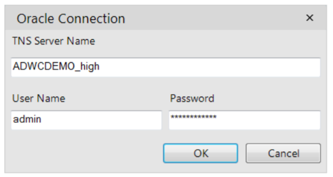
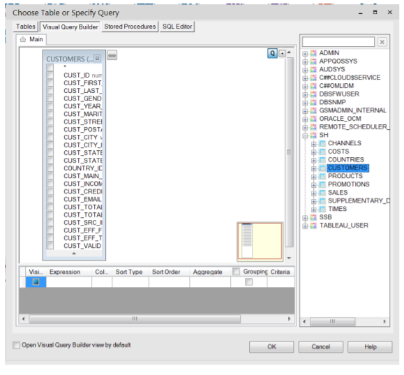
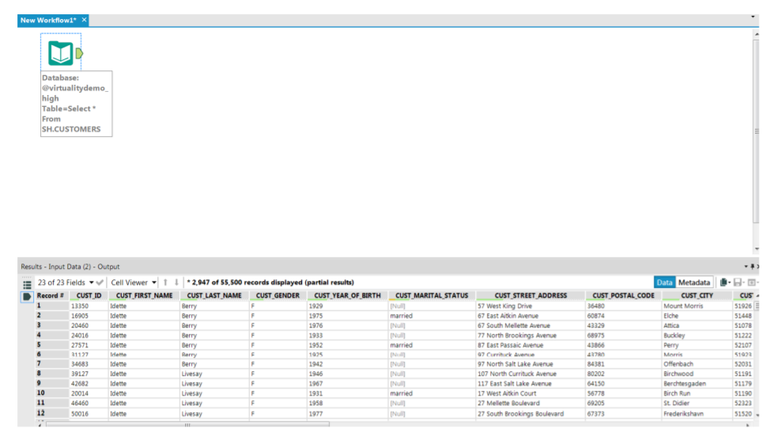

## **Connecting Alteryx to Oracle Autonomous Database**

## **Introduction**

This guide shows you how to configure Alteryx connectivity to Oracle Autonomous Database (ADB). 

These instructions use Oracle Instant Client from Oracle.

| Validation Matrix              | Version             |
| ------------------------------ | ------------------- |
| Alteryx Designer               | 2018.2              |
| Oracle Database Instant Client | 12.1.0.2 and higher |

## **Prerequisites**

This document assumes the following:

- Autonomous Database (ADB) is provisioned. ADB includes Autonomous Data Warehouse (ADW) or Autonomous Transaction Processing (ATP), or Autonomous JSON Database (AJD).  To provision ADB, see [here](https://docs.oracle.com/en/cloud/paas/autonomous-database/adbsa/autonomous-provision.html#GUID-0B230036-0A05-4CA3-AF9D-97A255AE0C08).
- Alteryx is installed on a machine (local, OCI, or other cloud).   
- Oracle Instant Client for Windows is downloaded and configured.  To install Oracle Instant Client see [here](https://www.oracle.com/database/technologies/instant-client/winx64-64-downloads.html).
- ADB Wallet is downloaded on your machine running Alteryx.

## **Configuring Alteryx with Oracle Client**

The simplest way to connect Alteryx Designer with ADB is to use the tnsnames based service connection. 

Once you have downloaded the ADB Wallet, unzip the files to the Oracle Instant Client directory, and set the TNS_ADMIN path to the directory. 

Below is an example of connecting Alteryx Designer with ADB after the prerequisites of installing the Oracle Client has been completed on Windows. 

1. Drag and drop the Input Data artifact into your Workflow canvas. From the ‘Connect a file or database’ section, choose the ‘Other Databases’ option and look for Oracle OCI… option. Enter the right TNS Service name, User Name and the Password and press OK. 

2. From the Schema tree, choose the right table and drag it into your Query Builder and press OK.

3. Run your workflow! You have successfully connected Alteryx Designer with ADWC. 

## **Acknowledgements**

* **Author(s)** - Vijay Balebail, Milton Wan, Database Product Management
* **Contributor(s)** - 
* **Last Updated By/Date** - Milton Wan, December 2022
