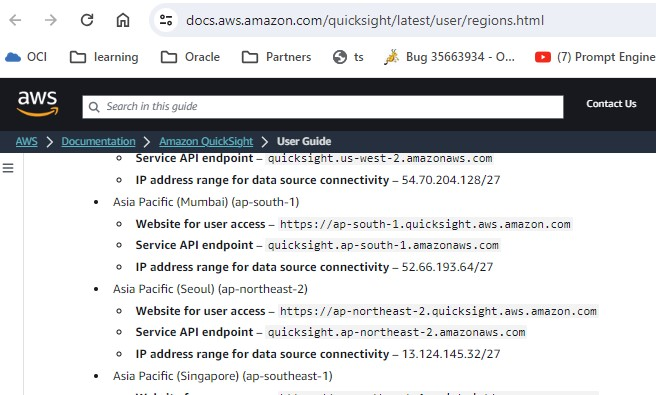
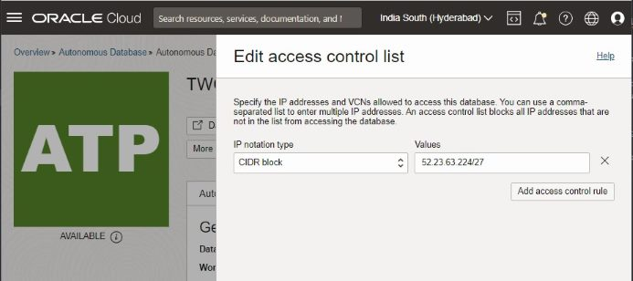
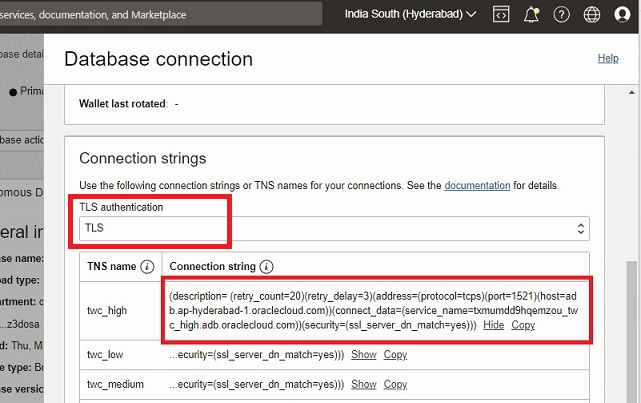
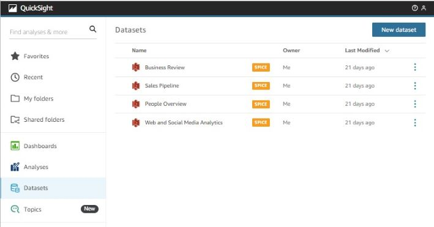
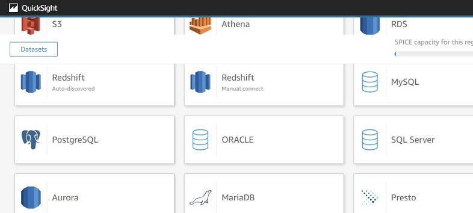
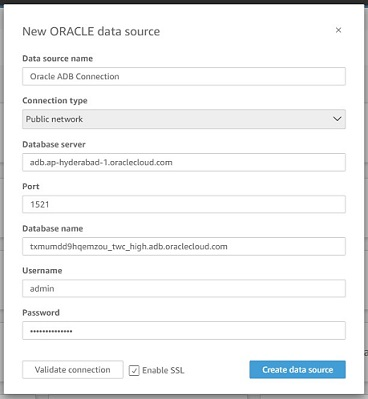
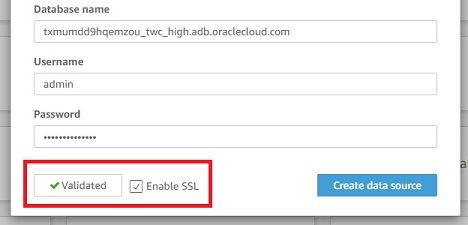
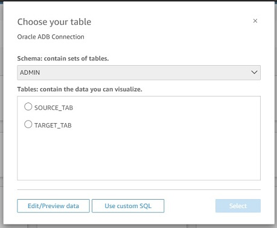

**Introduction**

Amazon QuickSight powers data-driven organizations with unified business intelligence (BI) at hyperscale. With QuickSight, all users can meet varying analytic needs from the same source of truth through modern interactive dashboards, paginated reports, embedded analytics, and natural language queries.

QuickSight can connect to various databases within the AWS cloud as well as other clouds services and on premise databases.  

AWS QuickSight does not support wallet based connections. Hence to connect to Oracle Autonomous database from QuickSight we need to configure the database for TLS connection and white list the public IP (CIDR bloc) or public endpoint given by AWS.  The list of these public endpoints are different for each AWS region, need to select the one you are using or use one closest to OCI region you are using for Autonomous Database.  The list of CIDR block per-region are listed here [AWS Regions, websites, IP address ranges, and endpoints](https://docs.aws.amazon.com/quicksight/latest/user/regions.html)

You can read further about [AWS QuickSight endpoints and quotas](https://docs.aws.amazon.com/general/latest/gr/quicksight.html).

**Important:** In this document we are only referring the basic connection, based on the security policy followed in your organization you can choose to establish a private endpoint for further restrict the access to closed network.

### **Prerequisites**

- Required access and credits to provision ADWC instance on Oracle Cloud.
- Should have account with required credits on AWS QuickSight
- If ADWC is already configured you have the ADMIN user password and ADB Wallet is downloaded on app server.

## **Configure the Connection**

## Step 1:  Obtain the QuickSight IP block and public endpoint  

Check the AWS region where you have QuickSight account and note the CIDR block published by AWS
e list of CIDR block per-region are listed here [AWS Regions, websites, IP address ranges, and endpoints](https://docs.aws.amazon.com/quicksight/latest/user/regions.html)

Note: if you are having a existing QuickSight account, and creating a new ADB instance in OCI,  chose a OCI region close to it. i.e.,  if you have QuickSight account on AWS, Mumbai region create your ADB instance in OCI, Mumbai OR OCI, Hyderabad region.  This just to ensure less network latency and better performance.

## Step 2: Configure TLS connection on ADB instance

Follow the instructions in document  [`Connect with one-way TLS without a Wallet`](?lab=no-wallet).  You need to whitelist the region CIRD block to connect.

## Step 3: Get ADW connection details

On the ADW console go to Connections tab, select TLS connection in the drop down menu. This would list the service names for TLS connection, click copy or show to get the details as show in the figure.
Note the following
 1. host name
 2. Service name
 3. Port number

## Step 4: Create new Dataset using Oracle Connection

  1. Login to AWS QuickSight, go to Datasets and click on new dataset button to create new dataset Connection.

  

  2. From the list of available databases, select Oracle Database option

  

  3. In the new data source window fill in the details requested. You can get all the details from the Oracle.

  Use the information noted in step 3
   1. Database Server name = host name
   2. Database name = Service name
   3. Port number = port number
   4. Username = database username (we used admin to connect)
   5. Password = password for the db user
   6. Ensure the SSL connection checkbox is checked

   

   Click on validate to check the connection.  If connection is successful It shows a green check mark on validate button.

   

   You have successfully connected to ADW instance. Click on  Connect button to connect to ADW.

   4. Click on connect to connect to ADW instance and proceed to use the connect as source or target.

   

## **Acknowledgements**
* **Author(s)** - Rajeev Rumale
* **Contributor(s)** - Satyabrata Mishra
* **Last Updated By/Date** - October 2023
