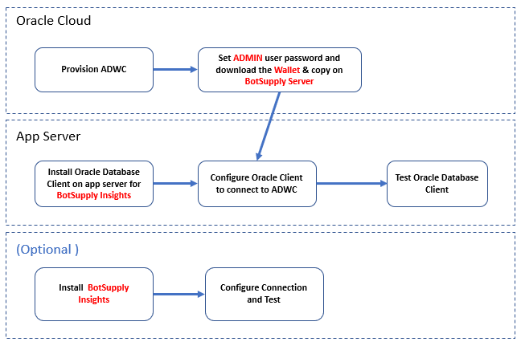

**Introduction**

This guide shows you how to configure Alteryx connectivity to Oracle Autonomous Database (ADB).  It describes how to connect Oracle Autonomous Database using the wallet or mTLS.  If you want to connect without the wallet click [here](https://oracle-samples.github.io/adb-connectors/common/tls-no-wallet/workshops/freetier/).


This guide shows you how to configure connection from BotSupply Insights to  Oracle Autonomous Data Warehouse (ADW).
These instructions use JDBC Thin driver from Oracle.


| Validation Matrix  | Version  |
| ------------- | ------------- |
| BotSupply Insights  | 1.0.0  |
| Oracle Client  | 19.6  |


## **Prerequisites**

- Required access and credits to provision ADWC instance on Oracle Cloud.
- Download Oracle JDBC Thin driver is downloaded on the app server were BotSupply is Installed.
- If ADWC is already configured you have the ADMIN user password and ADB Wallet is downloaded on your machine running BotSupply.

## **Configure the Connection**




## Step 1:  Provision ADWC and Configure Oracle Client on ISV  

1. Provision Autonomous Data Warehouse Cloud (ADWC) and download the corresponding credentials.zip file to the system that will have the BotSupply Insights installation and also get password of ADMIN for the ADWC instance. For the Oracle documentation to provision ADWC click here. Also check the set Downloading Client Credentials (Wallets).

2. All connections to Autonomous Data Warehouse Cloud use certificate-based authentication and Secure Sockets Layer (SSL). Uncompress credentials.zip file into a secure folder.

3. Download the Oracle Database Client to the system where BotSupply Insights is installed.   Validate that the Oracle Database Client can communicate with ADWC.

4. Create the TNS_ADMIN environment variable and set it to the location of the secure folder containing the credentials file you saved in Step 3

5. Edit the sqlnet.ora file, replacing “?/network/admin” with the name of the folder containing the client credentials. The location of folder is stored in TNS_ADMIN environment variable so use that variable in sqlnet.ora For example:

    ```
    WALLET_LOCATION = (SOURCE = (METHOD = file) (METHOD_DATA = (DIRECTORY=${TNS_ADMIN}))) SSL_SERVER_DN_MATCH=yes
    ```

6. The tnsnames.ora file provided with the credentials zip file contains three database service names identifiable as high, medium and low. The predefined service names provide different levels of performance and concurrency for Autonomous Data Warehouse Cloud. Use one of these service names in your ConnectString.

7. Test the Oracle Client with oracledb NPM library

    ```
    try{ let connection = await oracledb.getConnection({     user: "admin",     password: adminPassword,     connectString   }); } catch(err){  console.log(err); }    If the connection is successful you are ready to move to the next step.
    ```

## Step 2. Install BotSupply Insights To install  BotSupply Insights software:  

### Dependencies:
1. MongoDB
2. Node >v12
3. NPM
4. OS Used: Ubuntu 16.04  

### Steps:
1. Copy example.env to .env and fill proper details.
2. Install pm2 globally with npm install -g pm2.
3. Install dependencies with npm install.
4. Run npm run start from ADW/api directory.
5. For subsequent runs use npm run restart.

## **Acknowledgements**
* **Author(s)** - Dhruman Bhadeshiya
* **Contributor(s)** -
* **Last Updated By/Date** - Rajeev Rumale, January 2022
