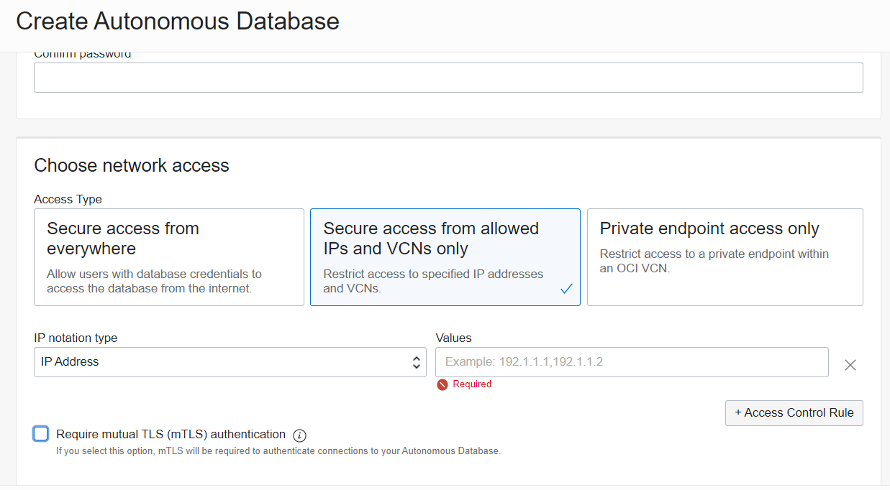
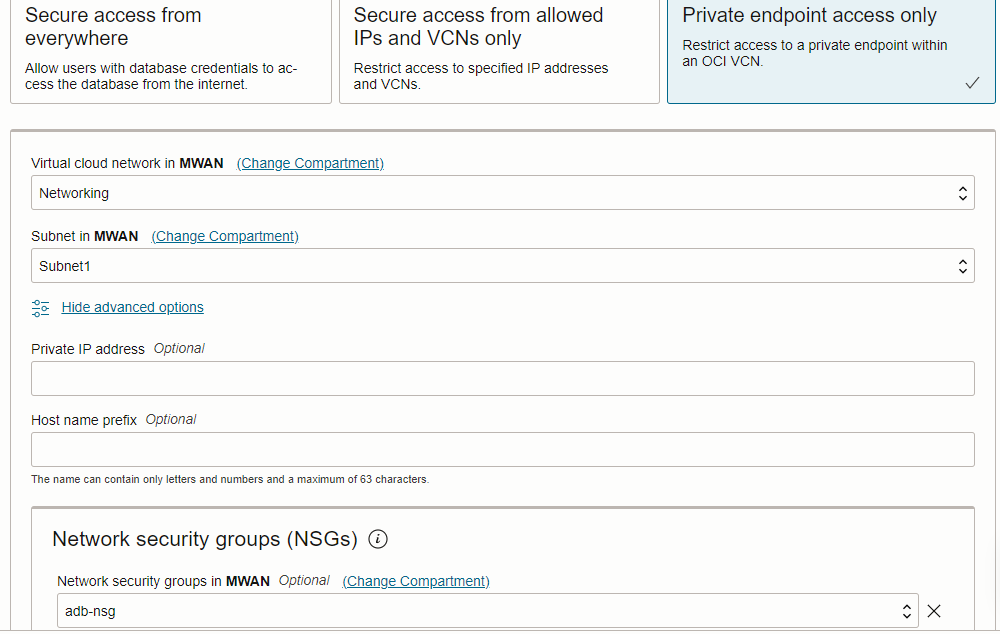

## Connect with one way TLS without a Wallet

You can connect your application to ADB without a wallet using one way TLS.  There is no need to download the ADB wallet.  You can connect securely with a public connection by setting ACLs or connect privately by configuring a private endpoint access.  This is done during the ADB provisioning.

### ACL Access

1. To configure the access control list (ACL) select Secure access from allowed IPs and VCNs only.  Select the IP notation type.  It can be IP Address, CIDR Block, or VCN.  

2. Uncheck the box Require mutual TLS (mTLS) authentication.

### Private Endpoint Access

1. Select Private endpoint access only.

2. Select your VCN and the subnet for the private endpoint.

3. Uncheck the box Require mutual TLS (mTLS) authentication.

   Note: You can also configure a network security group which allow you to define security rules for a set of VNICs instead of the entire subnet as with Security Lists.  For more information, see [here](https://docs.oracle.com/en-us/iaas/Content/Network/Concepts/networksecuritygroups.htm).

 

