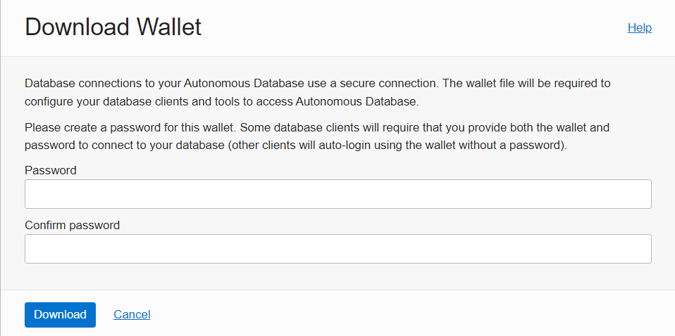
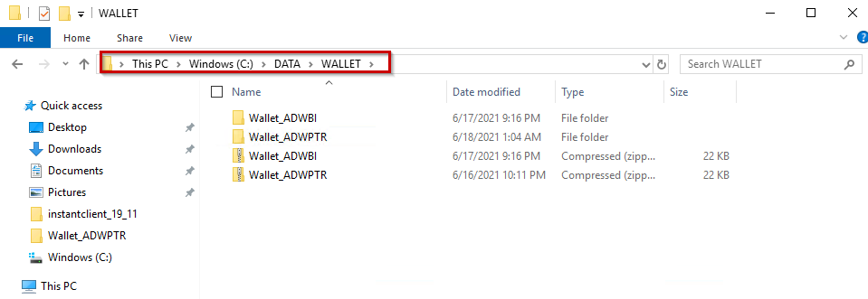
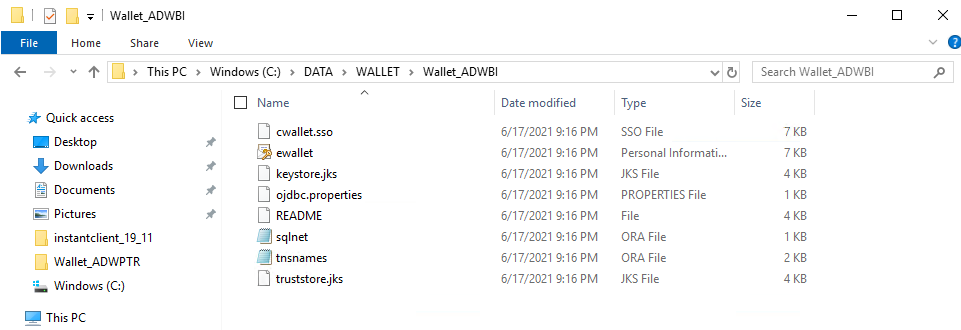
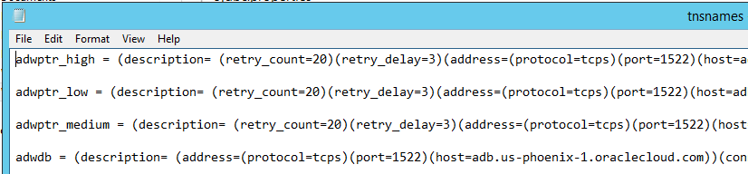

## **Download and Configure the Wallet**

After provisioning Oracle Autonomous Database (ADB), a wallet containing client credentials is required to connect to ADB. 


1. Download the wallet to the client machine running your BI or ETL tool.   Select Instance Wallet for the Wallet Type and click Download Wallet.


2. Enter a password for your wallet.  Some clients require a password to connect to ADB, other clients just use auto-login with the wallet.



3. Navigate to where you downloaded the Oracle ADB wallet. Unzip the contents to a secure directory.  Note:  The screens shown are for a Windows system.  The Linux procedures will be similar.







4. There are now two options to choose from:

   4.1 From the unzipped wallet directory, copy the tnsnames.ora and sqlnet.ora to the Oracle Client directory `c:\<Oracle Home>\network\admin` 

   4.2 or copy them to the directory specified by your application or BI/ETL tool vendor.  The tool vendor may have preferred location for these Oracle files.  

Note: If you do not have an Oracle Client directory and your tool vendor does not specify where to put the files, you may create the directory.

For example: `mkdir C:\oracle\instantclient_19_3\network\admin`

Note: If you are using JDBC Thin, you do not need the Oracle Client software.

5. Edit sqlnet.ora to point to the directory of the wallet directory containing the unzipped files.  For sqlnet.ora, an example follows.  For tnsnames.ora see below.

```
WALLET_LOCATION = (SOURCE = (METHOD = file) (METHOD_DATA = (DIRECTORY="C:\DATA\WALLET\Wallet_ADWBI")))
SSL_SERVER_DN_MATCH=yes
```

### Add TNS_ADMIN variable

6. This is optional with some applications.  In the Windows user environment variables dialog, create the `TNS_ADMIN` variable. Set its value to the directory location to where the sqlnet.ora and tnsnames.ora files are.  For example: `c:\<Oracle Home>\network\admin`.   In Linux, use export path `TNS_ADMIN`.


The tnsnames.ora file contains the net service names that will be used to connect to ADB.

### Connecting to multiple ADBs with different wallets

If you are connecting to multiple ADBs from the client machine with a different wallet for each one, add the parameter `MY_WALLET_DIRECTORY` to the connect descriptor with each descriptor’s specific wallet location.  Note: Setting this parameter will take precedence over the sqlnet.ora wallet location and sqlnet.ora wallet location will not be used.

For example:

```
adwptr_high = (description= (retry_count=20)(retry_delay=3)(address=(protocol=tcps)(port=1522)(host=adb.us-phoenix-1.oraclecloud.com))(connect_data=(service_name=bk8ui2h_adwptr_high.adwc.oraclecloud.com))(security=(ssl_server_cert_dn="CN=adwc.uscom-east-1.oraclecloud.com, OU=Oracle BMCS US, O=Oracle Corporation, L=Redwood City, ST=California, C=US")(MY_WALLET_DIRECTORY=C:\DATA\WALLET\Wallet_ADWPTR)))

adwbi_low = (description= (retry_count=20)(retry_delay=3)(address=(protocol=tcps)(port=1522)(host=adb.us-phoenix-1.oraclecloud.com))(connect_data=(service_name=bk8uqvi2h_adwbi_low.adb.oraclecloud.com))(security=(ssl_server_cert_dn="CN=adwc.uscom-east-1.oraclecloud.com, OU=Oracle BMCS US, O=Oracle Corporation, L=Redwood City, ST=California, C=US")(MY_WALLET_DIRECTORY=C:\DATA\WALLET\Wallet_ADWBI)))
```

 

7. Open the TNSNAMES.ora file in the wallet directory to see which ADB net service names are available to connect to. Below you see three different ones: `adwptr_high`, `adwptr_low`, and `adwptr_medium`. Your ADB net service names will likely be named differently.

 


## **Troubleshooting**

Check your TNS_ADMIN variable.  Make sure it points to the directory containing your tnsnames.ora.

`C:\WINDOWS\system32>echo %TNS_ADMIN%`

`C:\<Oracle Home>\network\admin`

Note: A restart of the Windows OS or your BI/ETL application may be needed for the environment variables to take effect.

Check your sqlnet.ora is set to the directory of your wallet or you are setting the directory using the parameter `MY_WALLET_DIRECTORY` in tnsnames.ora as explained above.

sqlnet.ora example with wallet directory:

```
WALLET_LOCATION = (SOURCE = (METHOD = file) (METHOD_DATA = (DIRECTORY="C:\Oracle\Wallets\Wallet_ADBPH")))
SSL_SERVER_DN_MATCH=yes
```

