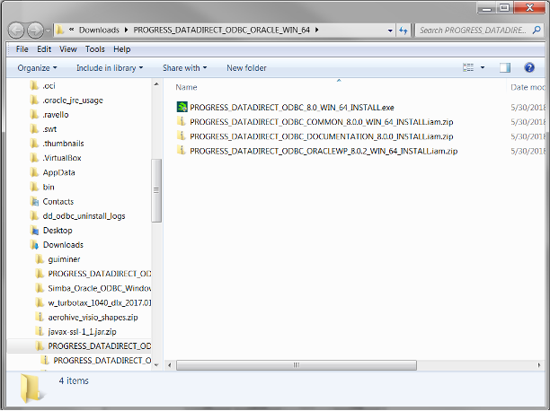
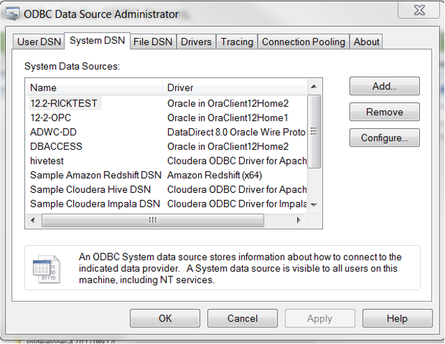
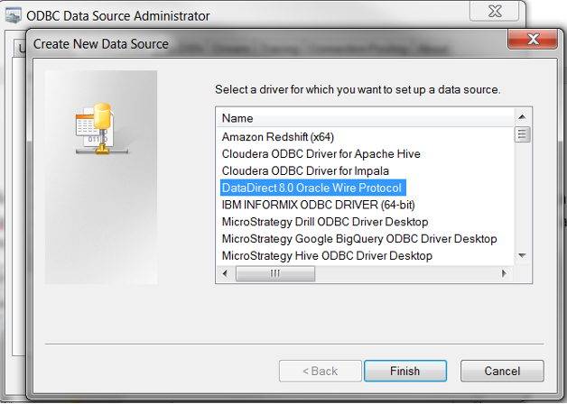
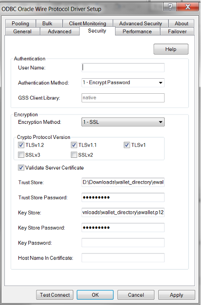
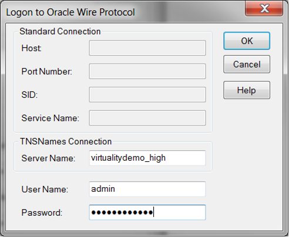
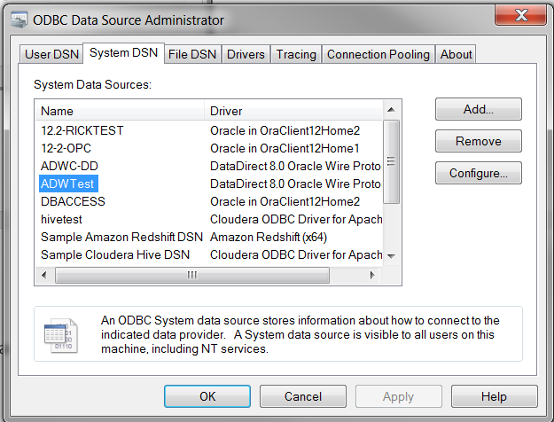

**Introduction**

ADW supports connections from standard drivers including JDBC, ODBC, and ADO.NET. Analytic tools may use 3rd party drivers from providers such as Progress DataDirect. In order to work with ADW, the driver must support Oracle Wallets and SSL encryption. Not all analytic tools package the latest driver versions, so you may be required to update the driver to successfully connect. Progress provides DataDirect drivers for both JDBC and ODBC. The versions supported for ADW are listed.

| **Connector Vendor** | **Version**                               |
| -------------------- | ----------------------------------------- |
| Progress DataDirect  | JDBC Driver 6.0 or above                  |
| Progress DataDirect  | ODBC Driver 8.0.2 (Oracle Wire  Protocol) |

DataDirect JDBC driver provides a high performance and reliable connectivity solution for many applications. The latest DataDirect JDBC driver for ADW is available for Windows as well as Unix and Linux, and can be downloaded [https://www.progress.com/jdbc/oracle-autonomous-data-warehouse-cloud#technical-specifications](https://www.progress.com/jdbc/oracle-autonomous-data-warehouse-cloud#technical-specifications)

This document further describes how to generally setup and configure DataDirect’s ODBC driver (DataDirect Oracle Wire Protocol), for tool vendors using this driver: [https://www.progress.com/odbc/oracle-database-cloud-service#technical-specifications](https://www.progress.com/odbc/oracle-database-cloud-service#technical-specifications)

Progress DataDirect ODBC download is [here](https://www.progress.com/download/thank-you?ds=oracle-database&interface=odbc&os=win-64&utm_source=google&utm_medium=cpc&utm_campaign=dci-trial-search-data-sources&gclid=Cj0KCQjwl7nYBRCwARIsAL7O7dG6XWVNvbKK02eGbxkkpsxIULza5nelyUhLvDJCgEWVzCVny4Tjw44aAkKoEALw_wcB&gclsrc=aw.ds&dclid=CIis_onardsCFc90AQodH6cGOA).

Please check the analytic tool documentation in case they have specific connectivity interfaces.

**DataDirect Oracle Wire Configuration**:

1. [Download](?lab=wallet.md) the Wallet (credentials file) from the ADW administration console and unzip the file. The location of this files directory will now be referred to as the *‘wallet_directory’*. Oracle credentials file is a zipped file that contains all the wallet formats as well as a pre-defined tnsnames.ora and sqlnet.ora that will be required to make a tnsnames based connection. This credentials file is protected by a password based encryption. You will use this password later on during the driver configuration. It will be referred to as KeyStore/TrustStore password.

2. Please refer to the Progress DataDirect documentation [here](https://www.progress.com/download/thank-you?ds=oracle-database&interface=odbc&os=win-64&utm_source=google&utm_medium=cpc&utm_campaign=dci-trial-search-data-sources&gclid=Cj0KCQjwl7nYBRCwARIsAL7O7dG6XWVNvbKK02eGbxkkpsxIULza5nelyUhLvDJCgEWVzCVny4Tjw44aAkKoEALw_wcB&gclsrc=aw.ds&dclid=CIis_onardsCFc90AQodH6cGOA) to install and configure the DataDirect Oracle Wire driver based on your OS. DataDirect Oracle Wire driver is available for Windows (32 bit and 64 bit), Unix/Linux and Mac OS.

3. This document shows how to install and configure the driver on Windows 64 bit OS. Invoke the 64-bit Microsoft ODBC Administrator to create a DSN (system or file) using tnsnames entry. More information about configuring the DataDirect Oracle Wire driver can be found [here](https://documentation.progress.com/output/DataDirect/odbcquickstarts/oracleodbc_win_quickstart/index.html#page/odbcoraclewin%2Fconfiguring-a-data-source.html%23wwID0EYLAI)

4. Below is a pictorial example for your reference. MSFT 64 bit Windows OS has been used for the example below.

    Download the DataDirect ODBC Drivers.
                                  

    Once unzipped and installed, open the 64 bit ODBC Administrator on Windows to configure system DSN that uses the DataDirect driver.

    

    Click on Add to configure a new system DSN under the System DSN tab. Locate the DataDirect 8.0 Oracle Wire Protocol from the list of drivers presented to you and press finish.

    

    You will be presented with a form for the DSN attributes. Fill in the DSN name, your TNS service name (this can be found in the tnsnames.ora file in TNS\_ADMIN location) and complete path to the tnsnames.ora (<*wallet_directory*>\tnsnames.ora)

    

    Next click on the Security tab and choose Encryption Method to be 1-SSL in the Encryption section. Also supply the path and name of the wallet to be used. Data Direct prefers the ewallet.p12 wallet file. The path should be <*wallet_directory*>\ewallet.p12. Supply this information for both the Trust Store as well as the Key Store sections. The password to be supplied here is *the KeyStore/TrustStore password*. You may optionally supply the Database username in the Authentication section.

    

    Test your connection by pressing the Test Connect button. Supply the database username and password to test the connection

    

    

    You are now ready to use this system DSN for your application!

    

    Note: These instructions are for reference purposes only. As versions of this driver changes, there may be different configuration methods. Please refer to the vendor website for latest details. Please refer to the vendor documentation on all the configuration options that are available for you to set.

## **Acknowledgements**
* **Author(s)** - Vijay Balebail
* **Contributor(s)** -
* **Last Updated By/Date** -  
