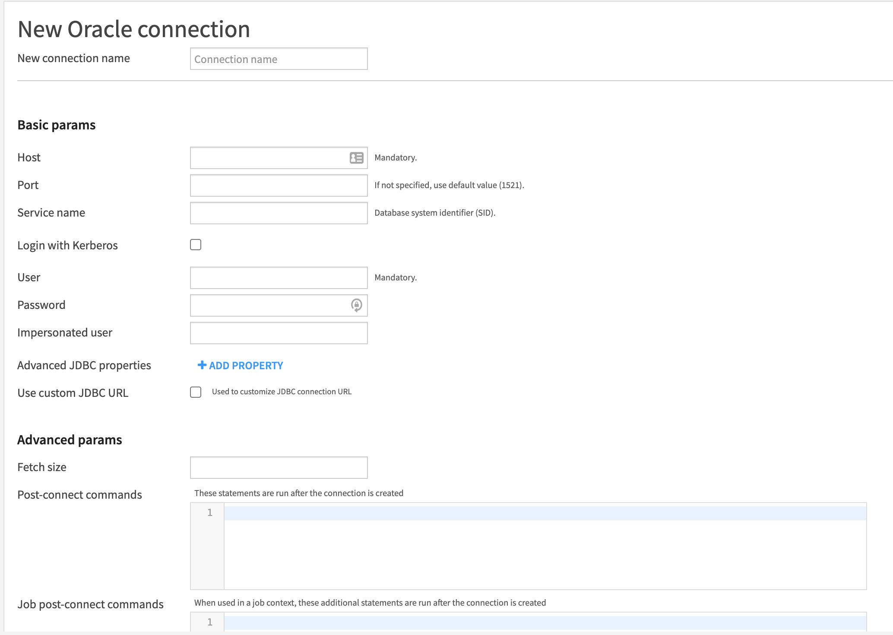

**Introduction**

This guide shows you how to configure Dataiku connectivity to Oracle Autonomous Database (ADB).

These instructions use JDBC Thin driver from Oracle.

## **Prerequisites**

- This document assumes that ADB, such as Autonomous Data Warehouse (ADW) or Autonomous Transaction Processing (ATP), or Autonomous JSON Database (AJD) is provisioned and Dataiku is installed on a machine (local, OCI, or other cloud).   To provision ADB, see [here](https://docs.oracle.com/en/cloud/paas/autonomous-database/adbsa/autonomous-provision.html#GUID-0B230036-0A05-4CA3-AF9D-97A255AE0C08).

- Oracle JDBC Thin driver is downloaded and configured.  Specific instructions on installing the jar file to dataiku are [here](?lab=jdbc-thin)
- ADB Wallet is [downloaded](?lab=wallet.md) on your machine running dataiku.

## **Configure the Connection**

Below is the screen shot of the dataiku UI for connecting to Oracle database.



From the tnsnames.ora file, locate the ADB service you want to connect to.  Note the connection description including host, port, and service name for your ADB.  

1. Enter the host, port, and service name of your ADB.  Note: The box for Service Name is service name, not SID.
2. Enter your user name and password for your ADB user.
3. Select Use custom JDBC URL and enter a URL like the following below.  The description is from your tnsnames.ora file.  Note you will need to add the parameter `my_wallet_directory` and the path to your wallet directory with the unzipped wallet files.


    ```
    jdbc:oracle:thin:@(description=(retry_count=1)(retry_delay=3)(address=(protocol=tcps)(port=1522)(host=adb.us-ashburn-1.oraclecloud.com))(connect_data=(service_name=wfkcrmds4waztfy_adwptr_high.adwc.oraclecloud.com))(security=(my_wallet_directory=/dss/data_dir/wallet/wallet_ADWPTR)(ssl_server_cert_dn="CN=adwc.uscom-east-1.oraclecloud.com,OU=Oracle BMCS US,O=Oracle Corporation,L=Redwood City,ST=California,C=US")))

    ```

## **Acknowledgements**
* **Author(s)** - Milton Wan, Database Product Management
* **Contributor(s)** -
* **Last Updated By/Date** - Milton Wan, December 2021
