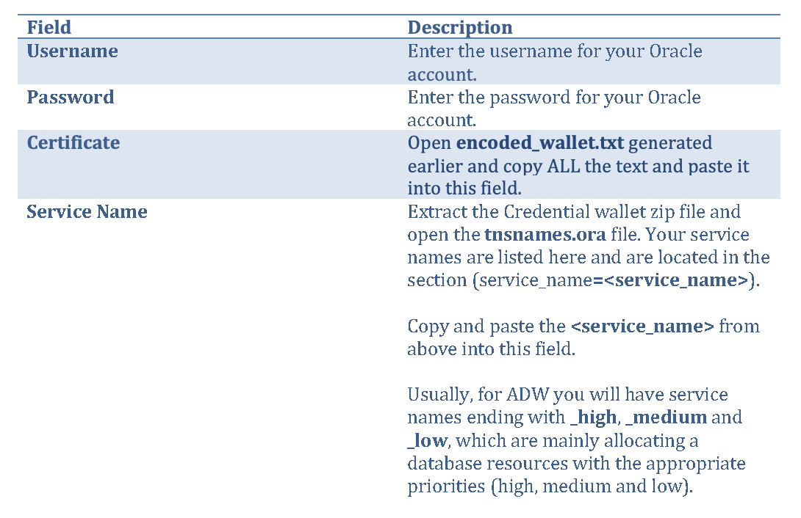

**Introduction**

Oracle Autonomous Data Warehouse (ADW) supports connections from standard drivers including JDBC, ODBC, and ADO.NET, and clients that use these compliant drivers. In order to work with ADW, the connector/driver must support Oracle Wallets and SSL encryption.

This document describes how to setup and configure Domo to connect to Oracle Autonomous Data Warehouse.

**Note:** These instructions are for reference purposes only. For specific connectivity screens, please check with Domo documentation for connecting to Oracle Autonomous Data Warehouse. Also, as versions of Domo and/or the Oracle Autonomous Data Warehouse changes, there may be a different method to connect. Please refer to Domo website for latest details.

Also note that these instructions apply to Oracle Autonomous Transaction Processing database as well.

**Prerequisites**

To connect to Oracle Autonomous Data Warehouse and create a Domo DataSet, you must have the following:

- Your Oracle username and password.

- The Credentials wallet for Oracle Autonomous Data Warehouse.

**Steps**

1. [Download](?lab=wallet) the Wallet from the ADW administration console. Keep the Credential wallet in its original format which is the Zip format.
2. Extract the certificate authority configuration information from the Credential wallet using **certutil** (Windows) or **base64** (Mac/Linux), as follows (**<wallet.zip>** is the downloaded Credentials wallet zip file):

    ​**Windows: certutil -encode <wallet.zip> encoded_wallet.txt**

    ​**Mac/Linux: base64 -i <wallet.zip> -o encoded_wallet.txt**

3. The above step will generate a text file named **encoded_wallet.txt**.
4. Next, locate the **Credentials** pane in the Oracle Autonomous Data Warehouse Cloud Connector page. This pane contains fields for entering credentials to connect to your Oracle Autonomous Data Warehouse account.

  The following table describes what is needed for each field:

    

​		 More details on preconfigured services for Autonomous Data Warehouse is here.

5) Once you have entered valid Oracle Database credentials, you can use the same account any time you go to create a new Oracle Database DataSet. You can manage connector accounts in the **Accounts** tab in the Data Center. For more information about this tab, see Managing User Accounts for Connectors.
