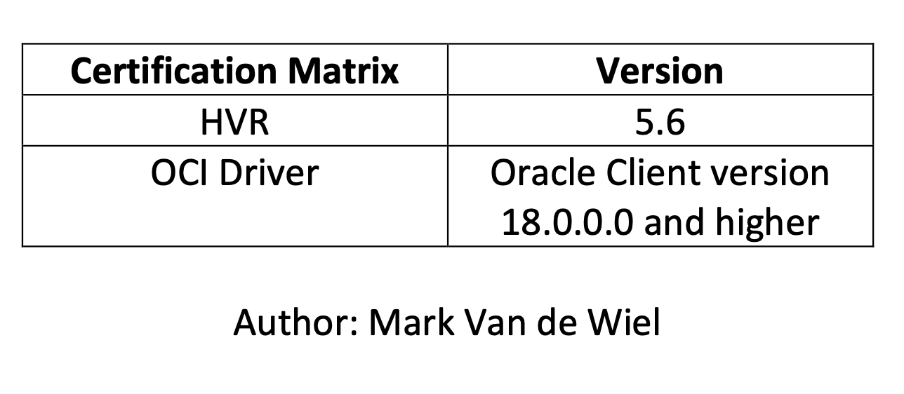
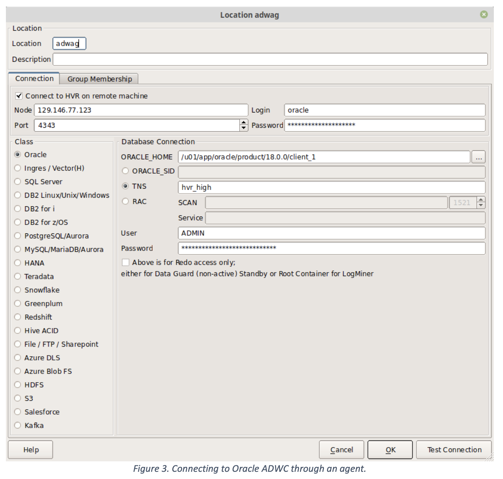

## Creating a connection from HVR to Oracle Autonomous Data Warehouse Cloud

###### 																							

This document provides an overview of the steps required to configure HVR to connect to the Oracle Autonomous Data Warehouse (ADWC).

HVR supports log-based Change Data Capture (CDC) for heterogeneous data replication from several source database technologies, into a multitude of destination technologies and data formats. HVR 5.6 is the first version certified to deliver data into the Oracle ADWC.

For optimum performance integrating changes into the Oracle ADWC, HVR recommends an architecture that features the use of agents. Agents are installations of the HVR software that are located as close as possible to the source and destination technologies. The use of agents will optimize network communication, and distribute load. HVR features such as initial load, ongoing replication and compare/repair all take advantage of the agents. With the Oracle ADWC as the target, the recommended setup is to include an agent in the Oracle Cloud, in the same availability domain as the ADWC, on a VM, or Bare Metal instance. TCP/IP communication into the Oracle Cloud can be encrypted.


###### Step 1: Provision ADWC plus Install and Configure the Oracle Client

1. Provision the Oracle Autonomous Data Warehouse Cloud (ADWC) and [download](../common/wallet/wallet.md) the Wallet to the system that will have the HVR target agent installation. For the Oracle documentation to provision ADWC click [here](https://www.oracle.com/webfolder/technetwork/tutorials/obe/cloud/adwc/OBE_Provisioning_Autonomous_Data_Warehouse_Cloud_bak/provisioning_autonomous_data_warehouse_cloud_v2.html). Also
    check [Downloading Client Credentials (Wallets)](../common/wallet/wallet.md).

2. All connections to the Oracle ADWC use certificate-based authentication and Secure Sockets Layer (SSL). Un-compress ***wallet*** file into a secure folder.

3. Download the Oracle Database Client to the system that runs the HVR integration agent.

    1. [Download Linux Client](../common/instant-client/instant-client-linux-64.md)

    2. [Download Windows Client](../common/instant-client/instant-client-windows-64.md)

4. Edit the sqlnet.ora file, replacing “?/network/admin” with the name of the folder

   containing the client credentials.


5. The TNS_ADMIN environment can be set to point to an alternative location for the sqlnet.ora and tnsnames.ora files. Define the variable if you plan to not use $ORACLE_HOME/network/admin. The tnsnames.ora credentials zip file contains three database service names identifiable as high, medium and low. The predefined service names provide different levels of performance and concurrancy for Autonomous Data Warehouse Cloud. Use one of these service names in your connect string.

6. Test the Oracle Client with Oracle SQL*Plus:

   ```
   sqlplus username@<connect string>
   ```

   <enter password at prompt>
    or
    sqlplus /nolog
    sql> connect username@<connect string> <enter password at prompt>

​		If the connection is successful you are ready to move to the next step.

###### Step 2: Install HVR

Follow the [installation instructions](https://www.hvr-software.com/docs/installing-and-upgrading-hvr) to install HVR.

Note that the HVR hub must be able to reach out to an agent installation through TCP/IP communication. As needed, open the firewall for the HVR listener port to the machine running the HVR agent. Also make sure the operating system allows the connection to go through.

###### Step 3: Configuring HVR to connect with ADWC

Connect the HVR GUI to the hub, connect to the metadata repository, and create a new Location. If the HVR hub resides in the Oracle Cloud then you may choose to connect directly to ADWC. Use the connect string you tested during the first installation step.


More commonly users will connect to the ADWC using an agent running on a VM in the Oracle Cloud.



You can now set up channels using the location as a target and enjoy the benefits of the Oracle Autonomous Data Warehouse Cloud.


-- Note depending on your HVR version you may, during initialize, have to use the low resource TNS connection, or as an alternative set an Environment action name HVR_SQL_INIT with value “alter session disable parallel dml”.