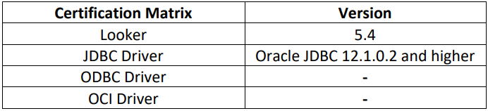
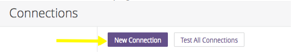
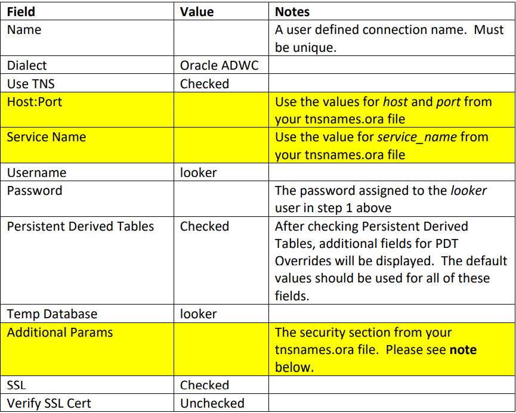
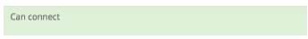
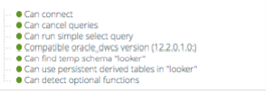

## **Creating a connection from Looker to Oracle Autonomous Data Warehouse**

  

This step by step guide shows you how to configure looker connectivity to Oracle Autonomous Database (ADB).

These instructions  work for both dedicated and shared infrastructure ADB.

## **Prerequisites**

This document assumes that ADB, such as Autonomous Data Warehouse (ADW) or Autonomous Transaction Processing (ATP), or Autonomous JSON Database (AJD) is provisioned and looker is installed on a Windows machine.  
To provision ADB, see [here](https://docs.oracle.com/en/cloud/paas/autonomous-database/adbsa/autonomous-provision.html#GUID-0B230036-0A05-4CA3-AF9D-97A255AE0C08).

Follow the instructions in this Looker document to configure your Oracle ADWC instance
for Looker. This will include creation of the looker user, which is referenced later in
these instructions see [here] (https://docs.looker.com/setup-and-management/database-config/oracle)

The instructions for ADWC vary slightly. The first step, Encrypt Network Traffic, can be
skipped as connections to ADWC are secured by default. Also, the instructions
reference objects owned by the sys user. For ADWC, the admin user should be
substituted wherever the sys user is referenced.

## **Configuring looker**


1. Click on the Admin link on the top right of the Looker UI

    

2. From the Admin Menu on the left side of the page, click on the Connections link

    

3. From the Connections page, click the New Connection Button

    

4. Populate the Connection Settings page based on the following table. There is an
   example of a properly completed Connection Settings page at the end of this document.
   Fields highlighted in yellow indicate values that are taken from the tnsnames.ora file.
   This file can be found by expanding the wallet zip file downloaded from your
   Autonomous Data Warehouse instance.

    

   Note: this includes the opening parenthesis before the word security as well as the two
   closing parenthesis at the end of the security section, however it does not include the
   final closing parenthesis - the one that matches the opening parenthesis for the
   description section.

   For example:
    ```
    (security=(ssl_server_cert_dn="CN=ADWC-dev.uscom-east-1.oraclecloud.com,OU=Testing Domain,O=End Point,L=Redwood
    Shores,ST=California,C=US"))
    ```

   Also note that some unintended formatting may be inserted when copying this value
   and inserting it into the field on the Looker form. Verify that no additional formatting,
   such as additional spaces, were added during the copy and paste process.

5. Click the **Test these Settings** button at the bottom of the page. If your settings have all
   been entered correctly and Looker is able to connect to your ADWC instance, you
   should see a success message like this below the button:

    

6. After adding the connection, you will be returned to the Connections page. Click the
   **Test** button next to your new connection. This will perform a more complete test of
   your connection, verifying that all of the configuration performed in Step 1 was
   completed successfully. If all tests complete successfully (the test can take up to a
   minute to complete), you should see a success message like this:

    

7.  You are now ready to get started exploring and visualizing your data! For instructions
    on how to get started, follow the Looker Developer Video Tutorials available at
    see [here](https://docs.looker.com/video-library/data-modeling).

​    and refer to our full set of online documentation at
    see [here](https://docs.looker.com).

## **Acknowledgements**
* **Author(s)** - Pedro Torres, Alex, Keh, Database Product Management
* **Contributor(s)** - Vijay Balebail, Milton Wan, Satyabrata Mishra Database Product Management
* **Last Updated By/Date** - Satyabrata Mishra, December 2021
