## **Connecting Microsoft Power BI Service to Oracle Autonomous Database and On-Premises Database**

This step-by-step tutorial guides configuring Microsoft Power BI service connectivity to Oracle Autonomous Database (ADB) and on-premises databases. Microsoft Power BI service runs in the Microsoft 365 cloud.

Power BI service uses on-premises data gateway, also known as Power BI gateway, to connect the Power
BI service to Oracle databases. The gateway is hosted on Windows that can either be on-premises or in a
cloud virtual machine, such as in Oracle Cloud Infrastructure or Azure.

These instructions use 64-bit unmanaged Oracle Data Provider for .NET (ODP.NET) for data access, as
required by Power BI service and on-premises gateway. They work for on-premises database and both
dedicated and shared infrastructure ADB. The instructions for on-premises databases setup also apply to
Oracle Database Cloud Services and Oracle Exadata Cloud Service.

## **Overview**

These are the general steps to setup Oracle database connectivity with Microsoft Power BI service:

- Provision Oracle database or ADB
- Download database credentials to Windows client
- Create Power BI service in Microsoft 365 cloud
- Install and configure Power BI gateway on Windows client
- Install and configure ODP.NET on Windows client
- Validate Power BI service connects to Oracle database or ADB

## **Prerequisites**

- This document assumes ADB, such as Autonomous Data Warehouse (ADW) or Autonomous Transaction Processing (ATP), or Autonomous JSON Database (AJD) is provisioned on OCI. To provision ADB, see [here](https://docs.oracle.com/en/cloud/paas/autonomous-database/adbsa/autonomous-provision.html#GUID-0B230036-0A05-4CA3-AF9D-97A255AE0C08).

- Connecting to Oracle databases on-premises and ADB are similar. This tutorial will note the differences
between them when setting up Power BI service connectivity.

- If using ADB, you will need access to the Oracle Cloud Console that has access to your ADB instance. Below is a screenshot from the cloud console to a database named ADWPTR.


- Power BI service and on-premises gateway uses 64-bit unmanaged ODP.NET (Oracle.DataAccess.Client) for
Oracle database connectivity. This tutorial was validated using ODP.NET, Unmanaged Driver, 19.15.

## **Install and Setup**

1. For ADB, go to the cloud console screen for the ADB instance you will connect to. Start your ADB instance.

   - Click on the “DB Connection” button. Download the corresponding ADB credentials zip file. Move the credential files to the Windows machine that hosts the gateway. These credential files `(cwallet.sso, tnsnames.ora, and sqlnet.ora)` will be used to connect the gateway and Power BI Desktop to ADB.
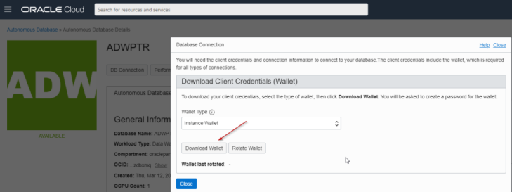

   - For <ins>on-premises</ins> databases, the credential files required depend on your database server setup. Typically, ODP.NET requires tnsnames.ora and sqlnet.ora to be accessible to connect to the database server. These files can be copied from another Oracle database client that connects to the target database server.
   - Alternatively, an Easy Connect or Easy Connect Plus string can be used in lieu of credential files for onpremises databases. For example, the Power BI gateway `“Server”` configuration setting can accept an Easy Connect string with the following format: `“<DB hostname>:<Port>/<Service Name>”`. If you use Easy Connect (Plus), you can skip the credential file downloading and setup steps in this tutorial.

2. Place the Oracle ADB or DB credentials on the Windows machine into a directory `(e.g. C:\data\wallet)`. This machine is where Power BI gateway is or will be installed on. It can be located on-premises or in the cloud, such as on an Oracle Cloud Infrastructure virtual machine, as long as it has network access to Power BI cloud service.

   - For ADB, the credentials have been downloaded into a zip file that you will unzip into this directory. Note the directory location for use in upcoming steps.

   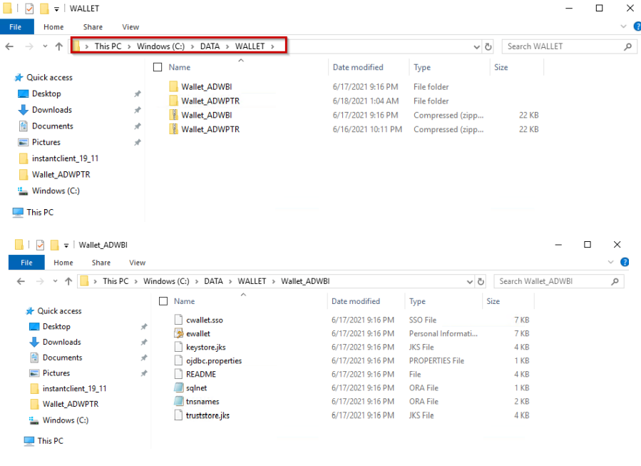

3. **<ins>ADB Only</ins>**

- If you are connecting to **one ADB instance**, open the sqlnet.ora configuration file in the credentials directory in a text editor. You will see the following line:

   ```
   WALLET_LOCATION = (SOURCE = (METHOD = file) (METHOD_DATA = (DIRECTORY="?/network/admin")))
   ```

   Set the DIRECTORY value to the ADB wallet directory location, such as:

   ```
   WALLET_LOCATION = (SOURCE = (METHOD = file) (METHOD_DATA = (DIRECTORY=C:\DATA\WALLET\)))
   ```

- If you are connecting to **multiple ADBs** from the same machine with a different wallet for each, add the parameter `MY_WALLET_DIRECTORY` to each connect descriptor’s specific wallet location in `tnsnames.ora`.

   For example:

   ```
   adwptr_high = (description=(retry_count=20)(retry_delay=3)(address=(protocol=tcps)(port=1522)
   (host=<host name>)) (connect_data=(service_name=<service name>))
   (security=(ssl_server_cert_dn="CN=adwc.uscom-east-1.oraclecloud.com, OU=Oracle BMCS US, O=Oracle
   Corporation, L=Redwood City, ST=California, C=US")(MY_WALLET_DIRECTORY=C:\DATA\WALLET\ADWPTR)))
   ```

   ```adwbi_high = (description=(retry_count=20)(retry_delay=3)(address=(protocol=tcps)(port=1522)
   (host=<host name>))(connect_data=(service_name=<service name>))
   (security=(ssl_server_cert_dn="CN=adwc.uscom-east-1.oraclecloud.com, OU=Oracle BMCS US, O=Oracle
   Corporation,L=Redwood City, ST=California, C=US")(MY_WALLET_DIRECTORY=C:\DATA\WALLET\ADWBI)))
   ```

After making your changes, `save` the file.

4. Since Power BI Gateway is a 64-bit application, we use 64-bit unmanaged ODP.NET to perform database access. 64-bit unmanaged ODP.NET  download is part of the Oracle Data Access Components (ODAC), which can be downloaded for free from the Oracle website

   - From the **XCopy ODAC Packages** section on the bottom half of the [ODAC Download page](https://www.oracle.com/database/technologies/net-downloads.html), click on the `ODAC 19c (32-bit and 64-bit)` link. Do not use ODAC 21c versions currently.
 

   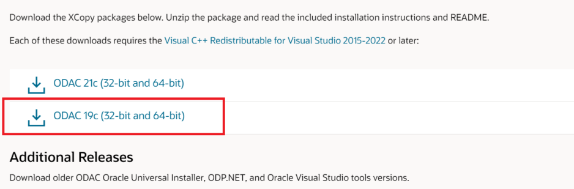

   Log on to the Oracle website. In the “Platforms” drop down, select 64-bit Windows, then download 64-bit Oracle Client for Microsoft Tools.

   

5. Now, we install ODP.NET. Unzip the download contents to a staging directory (e.g., `C:\xcopy64-install)`.

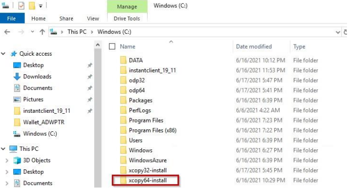

6. Open a Windows command prompt **in administrator mode**. Navigate to the ODAC staging directory, then execute the following command to install and configure ODP.NET:

```
install.bat <component_name> <oracle_home_path> <oracle_home_name>
<install_dependents> <machine_wide_configuration> <tns_admin_location>
```

To configure ODP.NET for Power BI Desktop, use the following values:
• <component_name> = `odp.net4`
• <oracle_home_name> = ODAC install directory, such as `C:\oracle`
• <oracle_home_name> = unique name for the ORACLE HOME, such as `myhome`
• <install_dependents> = `true`
• <machine_wide_configuration> = `true`
• <tns_admin_location> = Oracle database credential files directory, such as `C:\data\wallet`

A sample execution of install.bat with these arguments looks like:
`install.bat odp.net4 c:\oracle myhome true true c:\data\wallet`

7. If you are using tnsnames.ora file with your Oracle database, open the tnsnames.ora file to see which ADB or database net service names you can connect to. Below you see three different ones: `adwptr_high”, “adwptr_low”, and “adwptr_medium”`. You will use one of these values for the Power BI gateway `“Server”` name when configuring your Oracle connection.

   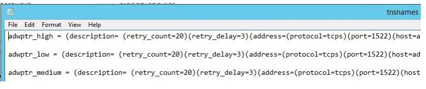

8. Sign on to the [Power BI website](https://powerbi.microsoft.com/en-us/) with your Microsoft 365 account.

   

9. We now download the Power BI gateway to the Windows machine and install it. You can skip steps 9 and
10 if you already have created and configured the Power BI gateway.

- From the Power BI web console, click the `“∙∙∙”` drop down menu in the upper right > “Download” > “Data
Gateway”.


- A web page will open. Click `“Download standard mode”` to download the gateway install.

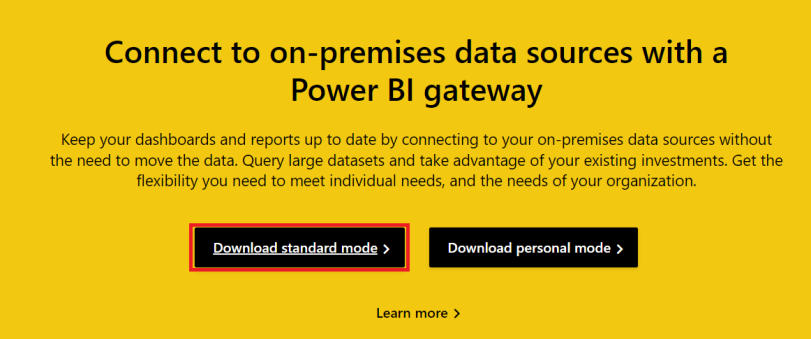

- Run `“GatewayInstall.exe”` file after it downloads. Enter the install directory location and accept the terms.


10. We will now complete registration of the Power BI gateway. Start by entering the email address of your Power BI service account. You will be asked to sign in to register the gateway with your Power BI account.

   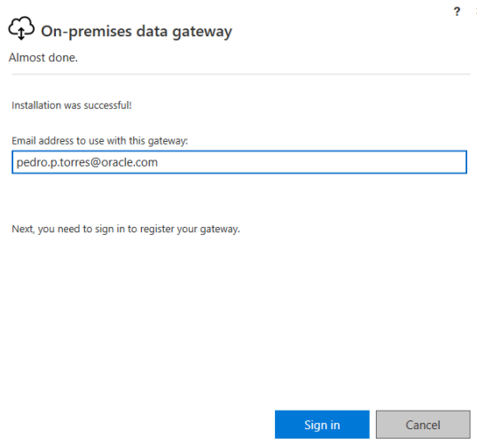

- Choose to register a new gateway on the computer. Click `“Next”`.

   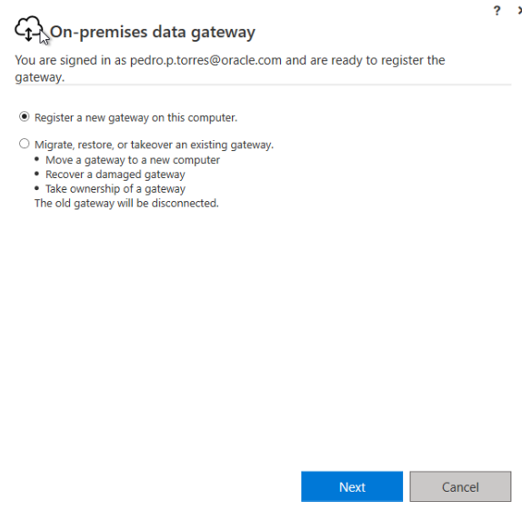

- Name the gateway (e.g. Gateway), provide the recovery key, and confirm the key. Click `“Configure”`. We
   will use the gateway name later when we create a Power BI Data Source.

   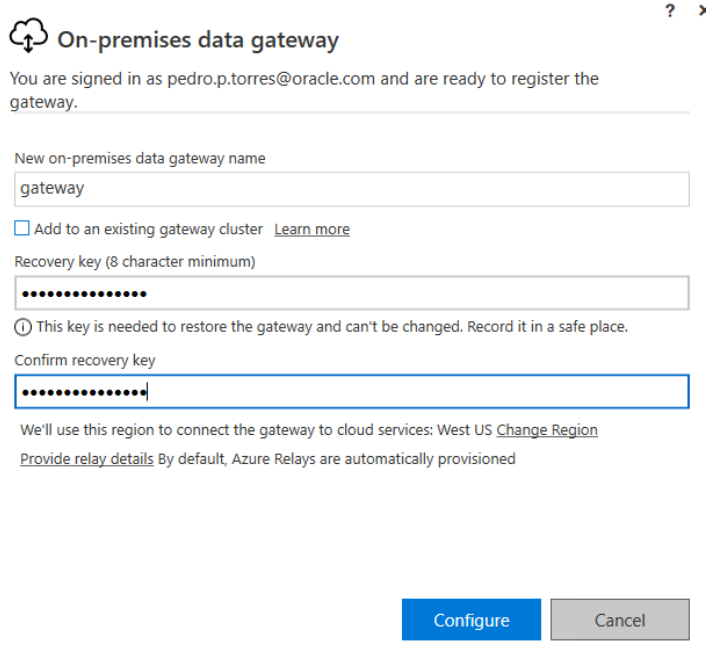

- The gateway should now be online and ready to use.

   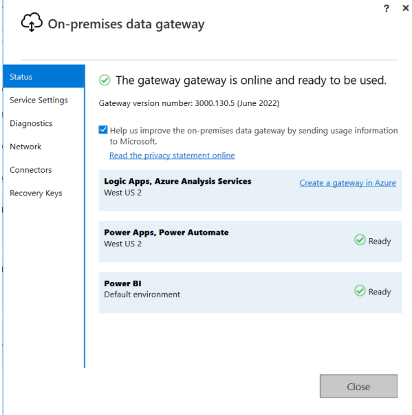

11. Go back to the Power BI website. Switch to a Power BI Premium or Power BI Pro workspace. Click `“New” > “Dataflow” > “Add new tables”`

   

12. Select `“Oracle database”`.

   

13. Provide the entries to connect to your data source:

    - Server = Enter the database net service name `(e.g. “adwptr_high”, “adwptr_low”)` or `Easy Connect (Plus) configuration`
    - Data gateway = Power BI gateway name `(e.g. gateway)`
    - Authentication kind = `Basic`
    - Username and Password = `Your ADB or on-premises database user credentials`

   Click the `“Next”` button

   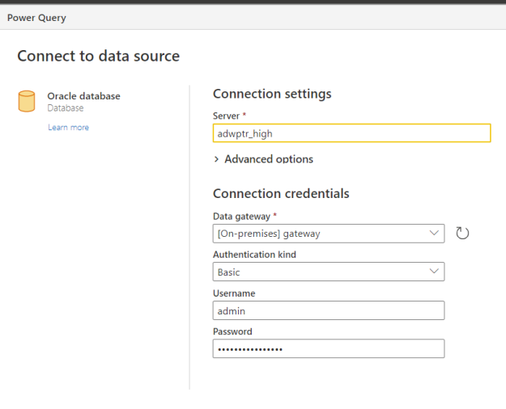

14. Congratulations! Your Power BI service instance is now connected to Oracle database. You should now be able to view the schema objects available to the Oracle user. In the tree control, select the schema objects needed for your Microsoft Power BI application and load the data.

   

**Performance Tuning for Large Data Retrievals**

Typically, BI and ETL applications retrieve large data amounts from a source database for further processing.

To speed up Oracle data retrieval via Power BI Desktop, the ODP.NET FetchSize can be increased from its
default 128K value (131,072 bytes) to as large as int.MaxValue. The FetchSize determines the amount of data 10 ODP.NET fetches into its internal cache upon each database round trip. It’s possible to improve performance by an order of magnitude by significantly increasing FetchSize when retrieving large result sets.

**<ins>Unmanaged ODP.NET Instructions</ins>**

To increase the 32-bit or 64-bit unmanaged ODP.NET’s FetchSize, launch the Windows Registry editor
(regedit.exe) and go to the following Registry key:
`HKEY_LOCAL_MACHINE\SOFTWARE\Oracle\ODP.NET\4.122.19.1`

Add the String Value `FetchSize` and set it to a value larger than the default (131072), such as 4194304 (4 MB).

Restart Power BI Desktop and run your queries with the new setting.


## **Acknowledgements**

- **Author(s)** - Pedro Torres, Alex, Keh, Database Product Management

- **Contributor(s)** - Blake Hendricks, Vijay Balebail, Milton Wan, Database Product Management
- **Last Updated By/Date** - Blake Hendricks, January 2023
