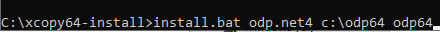
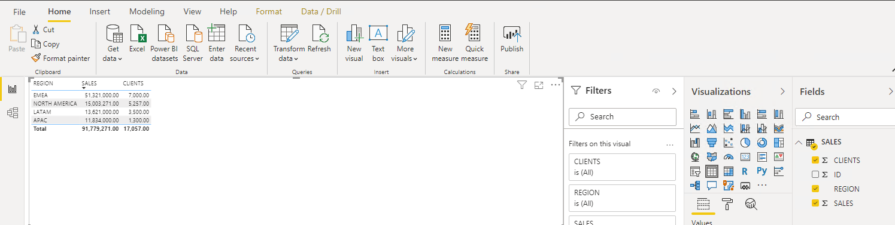

## **Connecting Microsoft Power BI Desktop to Oracle Autonomous Database**


This step by step guide shows you how to configure Microsoft Power BI Desktop connectivity to Oracle Autonomous Database (ADB). 

These instructions use managed or unmanaged Oracle Data Provider for .NET (ODP.NET) for data access and work for both dedicated and shared infrastructure ADB.

## **Prerequisites**

This document assumes that ADB, such as Autonomous Data Warehouse (ADW) or Autonomous Transaction Processing (ATP), or Autonomous JSON Database (AJD) is provisioned and Power BI Desktop is installed on a Windows machine (local, in Azure, or OCI).  To provision ADB, see [here](https://docs.oracle.com/en/cloud/paas/autonomous-database/adbsa/autonomous-provision.html#GUID-0B230036-0A05-4CA3-AF9D-97A255AE0C08). 


Power BI may use managed ODP.NET or unmanaged ODP.NET for its ADB connectivity. This tutorial was tested with Power BI’s May 2021 version, which requires unmanaged ODP.NET for Oracle database connectivity. It is possible that Microsoft will update Power BI to use managed ODP.NET in a future version. This tutorial guides you on using either unmanaged or managed ODP.NET with Power BI.


## **Installation and Setup Steps**

1. Download the corresponding Oracle ADB credentials zip file to the system that has or will have Power BI Desktop installed. These credential files will be used to connect Power BI Desktop to ADB.


2. Open Power BI Desktop and select Get Data.


3. At this point, we are merely determining which ODP.NET provider your Power BI Desktop instance is hard-coded to use. We will configure the correct provider once we learn this information. Select Database > Oracle database > Connect to attempt to connect to an Oracle database.


4. If the error indicates it is trying to use **Oracle.DataAccess.Client** assembly, then set up Power BI Desktop with **unmanaged ODP.NET**. If the error says it is trying to use **Oracle.ManagedDataAccess.Client**, then use **managed ODP.NET**.

 

If you need to use unmanaged ODP.NET, determine if Power BI is either 32-bit or 64-bit. To look up Power BI Desktop’s bitness, select File > Help > About. 


In the above screenshot, we see that 64-bit Power BI Desktop is being used. That means 64-bit unmanaged ODP.NET must be installed and configured for Power BI to connect to ADB. If 32-bit Power BI Desktop was being used, then 32-bit unmanaged ODP.NET would be required. 

The following instructions cover all scenarios, whether you are using managed or unmanaged ODP.NET or you are using 32-bit or 64-bit Power BI. 

5. If you require 64-bit managed ODP.NET or unmanaged ODP.NET, download 64-bit ODAC 19.3 from the     ODAC Xcopy section in the middle of this [Oracle web page](https://www.oracle.com/database/technologies/dotnet-odacdeploy-downloads.html). If you require 32-bit unmanaged ODP.NET, download 32-bit ODAC 19c.


6. Now, we’ll install ODP.NET.  Installation instructions are the same for managed ODP.NET, 32-bit unmanaged ODP.NET, and 64-bit unmanaged ODP.NET. Unzip the download contents to a staging directory (e.g. c:\xcopy64-install or c:\xcopy32-install).


7. Open a Windows command prompt **in administrator mode.** Navigate to the staging directory, then execute the next command to install ODP.NET:

​     install.bat odp.net4 `<installation directory>` odp64




Note: Enter the installation location (e.g. c:\odp64 or c:\odp32) for the directory parameter.


8. Configuration instructions differ between managed ODP.NET and unmanaged ODP.NET. In the same command prompt **in administrator mode,** navigate to the installation subdirectory, `<installation directory>`\odp.net\bin\4. Then, execute the following commands:

a.    To configure unmanaged ODP.NET:

OraProvCfg /action:gac /providerpath:"Oracle.DataAccess.dll"


OraProvCfg /action:config /product:odp /frameworkversion:v4.0.30319 /providerpath:"Oracle.DataAccess.dll"


Note: Validate that you are using the correct path for Oracle.DataAccess.dll file.

a.    To configure managed ODP.NET

OraProvCfg /action:gac /providerpath:"../../managed/common/Oracle.ManagedDataAccess.dll"

OraProvCfg /action:config /product:odpm /frameworkversion:v4.0.30319 /providerpath:"../../managed/common/Oracle.ManagedDataAccess.dll"

 

9. (For unmanaged ODP.NET only) Edit the Windows environment variables by adding the path value of the 64-bit Oracle Client directory (e.g. c:\odp64) or 32-bit Oracle Client directory (e.g. c:\odp32) depending on the version Power BI you are using.


To ensure this directory path setting has precedence over existing Oracle Homes, move the setting up to the highest possible level in the directory order with the “Move Up” button.

 

10. Navigate to where you downloaded the Oracle ADB credentials on your Windows machine. Unzip the contents to a directory.


11. In the Windows user environment variables dialog, create the TNS_ADMIN variable. Set its value to the directory location where you unzipped the ADB wallet contents. 


The tnsnames.ora net service names will be used to connect to ADB.

If you are connecting to multiple ADBs from the same Power BI client machine with a different wallet for each one, add the parameter `MY_WALLET_DIRECTORY` to the connect descriptor with each descriptor’s specific wallet location.  Note: Setting this parameter will take precedence over the sqlnet.ora wallet location also.  

For example:

*adwptr_high = (description= (retry_count=20)(retry_delay=3)(address=(protocol=tcps)(port=1522)(host=adb.us-phoenix-1.oraclecloud.com))(connect_data=(service_name=bk8ui2h_adwptr_high.adwc.oraclecloud.com))(security=(ssl_server_cert_dn="CN=adwc.uscom-east-1.oraclecloud.com, OU=Oracle BMCS US, O=Oracle Corporation, L=Redwood City, ST=California, C=US")(**MY_WALLET_DIRECTORY=C:\DATA\WALLET\Wallet_ADWPTR**)))*

*adwbi_low = (description= (retry_count=20)(retry_delay=3)(address=(protocol=tcps)(port=1522)(host=adb.us-phoenix-1.oraclecloud.com))(connect_data=(service_name=bk8uqvi2h_adwbi_low.adb.oraclecloud.com))(security=(ssl_server_cert_dn="CN=adwc.uscom-east-1.oraclecloud.com, OU=Oracle BMCS US, O=Oracle Corporation, L=Redwood City, ST=California, C=US")(**MY_WALLET_DIRECTORY=C:\DATA\WALLET\Wallet_ADWBI**)))*

 

12. Open the TNSNAMES.ora file in the wallet directory to see which ADB net service names are available to connect to. Below you see three different ones: `adwptr_high`, `adwptr_low`, and `adwptr_medium`. Your ADB net service names will likely be named differently.

 


13. Open Power BI Desktop again, select Get Data, Database Oracle and click Connect

 


14. Using one of your net service names, select DirectQuery, and OK.


15. Then select Database and enter your username and password for ADB, and Connect


16. Congratulations! Your Power BI Desktop instance should now be connected to ADB. Open in Navigator the tables that you need data to create your Microsoft Power BI Desktop Document (.pbix) and load the data.


17. Create your own graph or retrieve the data in the table





## **Troubleshooting**

If you get connection issues or an error such as "Object reference not set to an instance of an object."

Check that you have added the environment variables properly.

```
C:\WINDOWS\system32>echo %PATH%

**C:\odp64**;C:\Program Files (x86)\Common Files\Oracle\Java\javapath;C:\WINDOWS\system32;C:\WINDOWS;C:\WINDOWS\System32\...

C:\WINDOWS\system32>echo %TNS_ADMIN%

C:\Wallet\Wallet files...
```

Note: A restart of the Windows OS may be needed for the environment variables to take effect.

Check your sqlnet.ora is set to the directory of your wallet or you are setting the directory using the parameter `MY_WALLET_DIRECTORY` in tnsnames.ora

## **Performance Tuning for Large Data Retrievals**

Typically, BI and ETL applications retrieve large data amounts from a source database for further processing. To speed up Oracle data retrieval via Power BI Desktop, the ODP.NET `FetchSize` can be increased from its default 128K value (131,072 bytes) to as large as int.MaxValue. The `FetchSize` determines the amount of data ODP.NET fetches into its internal cache upon each database round trip. It’s possible to improve performance by an order of magnitude by significantly increasing `FetchSize` when retrieving large result sets.

### Unmanaged ODP.NET Instructions

To increase the 32-bit or 64-bit unmanaged ODP.NET’s FetchSize, launch the Windows Registry editor (regedit.exe) and go to the following Registry key: `HKEY_LOCAL_MACHINE\SOFTWARE\Oracle\ODP.NET\4.122.19.1`

Add the String Value "FetchSize" and set it to a value larger than the default (131072), such as 4194304 (4 MB). 

Restart Power BI Desktop and run your queries with the new setting.

### Managed ODP.NET Instructions

To increase managed ODP.NET’s FetchSize, modify the .NET machine.config file. Modifying the machine.config requires Windows Administrator privileges. This file is generally located in the following directory: **C:\WINDOWS\Microsoft.NET\Framework\v4.0.30319\Config**.

 Add an oracle.manageddataaccess.client section in the machine.config file for managed ODP.NET. This section should be placed within the `<configuration>` section and after the `<configSections> </configSections>`. Here’s an example setting the `FetchSize` to 4 MB:

```
 <configuration>

 <configSections>

…

  </configSections>

 <oracle.manageddataaccess.client>

  <version number="\*">

   <settings>

​    <setting name="FetchSize" value="4194304" />

   </settings>

  </version>

 </oracle.manageddataaccess.client>

 </configuration>
```

 

Once done, restart Power BI Desktop so that ODP.NET will use the new setting.


## **Acknowledgements**
* **Author** - Pedro Torres, Alex, Keh, Database Product Management
* **Contributor** - Vijay Balebail, Milton Wan, Database Product Management
* **Last Updated By/Date** - Milton Wan, December 2021
