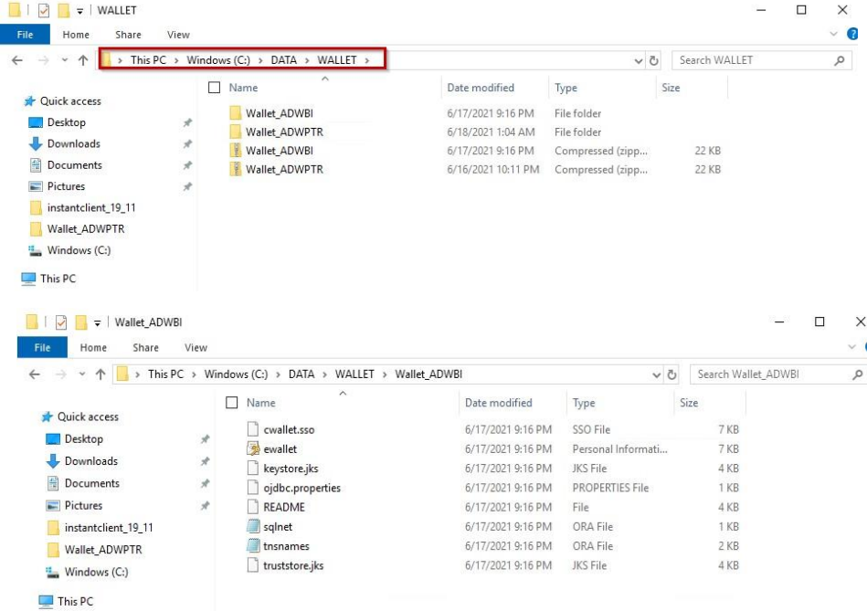
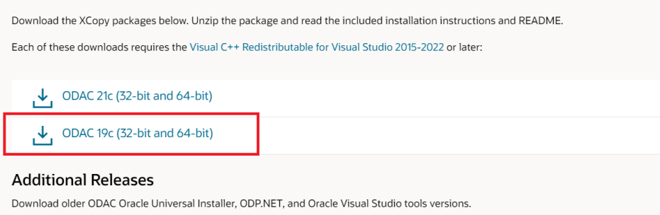
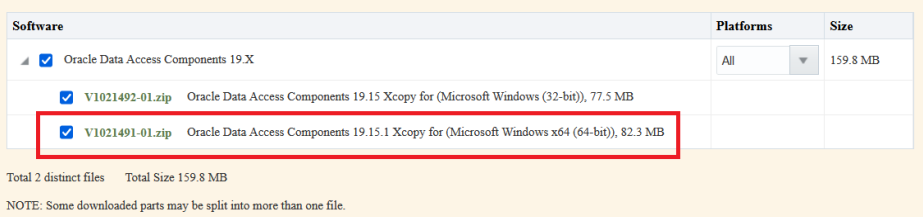
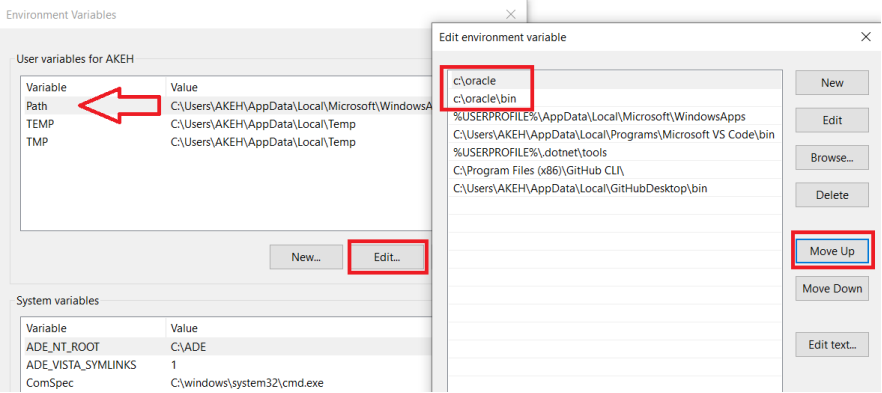
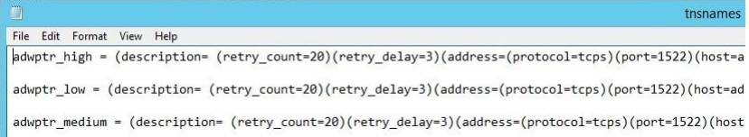
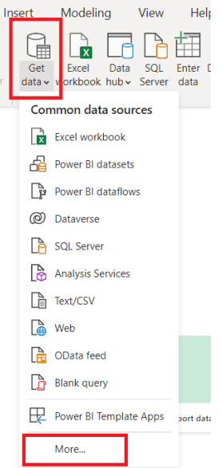
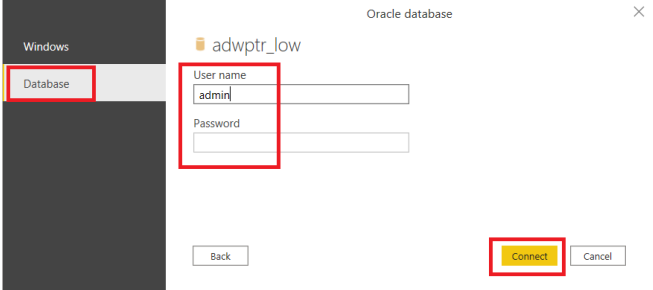
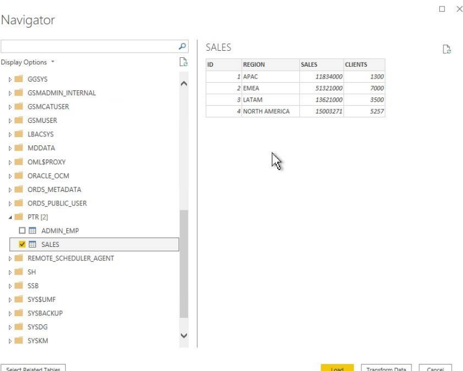

## **Connecting Microsoft Power BI Desktop to Oracle Autonomous Databases and On-premises Databases**

This step-by-step tutorial guides how to configure `Microsoft Power BI Desktop` connectivity to `Oracle Autonomous Database` (ADB) and on-premises databases.

These instructions use unmanaged Oracle Data Provider for .NET (ODP.NET) for data access as required by Power BI Desktop. They work for on-premises database and both dedicated and shared infrastructure ADB. The instructions for on-premises databases setup also apply to Oracle Database Cloud Services and Oracle Exadata Cloud Service.

This guide shows you how to configure Microsoft Power BI Desktop connectivity to Oracle Autonomous Database (ADB).  It describes how to connect Oracle Autonomous Database using the wallet or mTLS.  If you want to connect without the wallet click [here](https://oracle-samples.github.io/adb-connectors/common/tls-no-wallet/workshops/freetier/).

## **Prerequisites**

- This document assumes that ADB, such as `Autonomous Data Warehouse (ADW)` or `Autonomous Transaction Processing (ATP)`, or `Autonomous JSON Database (AJD)` is provisioned and Power BI Desktop is installed on a `Windows machine (local, in Azure, or OCI)`.  To provision ADB, see [here](https://docs.oracle.com/en/cloud/paas/autonomous-database/adbsa/autonomous-provision.html#GUID-0B230036-0A05-4CA3-AF9D-97A255AE0C08).
- Connecting to Oracle databases on-premises and ADB are similar. This tutorial will note the differences
between them when setting up Power BI connectivity.
- ADB Wallet is downloaded on your machine running Power BI Gateway.  To download and configure the wallet see [here](?lab=wallet).
- If using ADB, you will need access to the Oracle Cloud Console that has access to your ADB instance. Below is a screenshot from the cloud console to a database named ADWPTR

- Power BI Desktop uses unmanaged ODP.NET (Oracle.DataAccess.Client) for Oracle database connectivity. This tutorial was tested with Power BI’s June 2022 version using ODP.NET, Unmanaged Driver, 19.15

## **Overview**

These are the general steps to setup Oracle database connectivity with Microsoft Power BI Desktop:
• Provision Oracle database or ADB
• Download database credentials to Windows client
• Install Power BI on Windows client
• Install and configure ODP.NET on Windows client
• Validate Power BI connects to Oracle database or ADB

## **Installation and Setup Steps**

1. For ADB, go to the cloud console screen for the ADB instance you will connect to. Start your ADB
instance. Click on the “DB Connection” button. Download the corresponding ADB credentials zip file to
the system that has Power BI Desktop installed. These credential files `(cwallet.sso, tnsnames.ora, and
sqlnet.ora)` will be used to connect Power BI Desktop to ADB.


- For on-premises databases, the credential files required will depend on your database server setup.
Typically, ODP.NET requires tnsnames.ora and sqlnet.ora to be accessible to connect to the database
server. These files can be copied from another Oracle database client that connects to the target
database server.

- Alternatively, an Easy Connect or Easy Connect Plus string can be used in lieu of credential files for onpremises databases. For example, the Power BI Desktop “Server” configuration setting can accept an Easy
Connect string with the following format: `<DB hostname>:<Port>/<Service Name>`. If you use Easy Connect (Plus), you can skip the credential file downloading and setup steps in this tutorial.

2. Place the Oracle ADB or DB credentials on your Windows machine into a directory `(e.g. C:\data\wallet)`. This machine is where Power BI Desktop is or will be installed on. For ADB, the credentials have been
downloaded into a zip file that you will unzip into this directory. Note the directory location for use in upcoming steps.



3. **<ins>ADB Only</ins>**

- If you are connecting to **one ADB instance**, open the sqlnet.ora configuration file in the credentials
directory in a text editor. You will see the following line:

```
WALLET_LOCATION = (SOURCE = (METHOD = file) (METHOD_DATA = (DIRECTORY="?/network/admin")))
```

- Set the DIRECTORY value to the ADB wallet directory location, such as:

```
WALLET_LOCATION = (SOURCE = (METHOD = file) (METHOD_DATA = (DIRECTORY=C:\DATA\WALLET\)))
```

- If you are connecting to **multiple ADBs** from the same machine with a different wallet for each, add the
parameter `MY_WALLET_DIRECTORY` to each connect descriptor’s specific wallet location in
`tnsnames.ora`.

For example:

```
adwptr_high = (description=(retry_count=20)(retry_delay=3)(address=(protocol=tcps)(port=1522)
(host=<host name>)) (connect_data=(service_name=<service name>))
(security=(ssl_server_cert_dn="CN=adwc.uscom-east-1.oraclecloud.com, OU=Oracle BMCS US, O=Oracle
Corporation, L=Redwood City, ST=California, C=US")(MY_WALLET_DIRECTORY=C:\DATA\WALLET\ADWPTR)))
```

```adwbi_high = (description=(retry_count=20)(retry_delay=3)(address=(protocol=tcps)(port=1522)
(host=<host name>))(connect_data=(service_name=<service name>))
(security=(ssl_server_cert_dn="CN=adwc.uscom-east-1.oraclecloud.com, OU=Oracle BMCS US, O=Oracle
Corporation,L=Redwood City, ST=California, C=US")(MY_WALLET_DIRECTORY=C:\DATA\WALLET\ADWBI)))
```

- After making your changes, `save` the file.

4. Let’s determine whether you are using 32-bit or 64-bit Power BI Desktop. The bitness of Power BI
Desktop and ODP.NET must match, meaning they both must be 32-bit or both 64-bit. In Windows, start
Power BI Desktop. On the menu, select `Help` > `About` to see a window similar to the following:


- In the above screen shot, we see that it is 64-bit Power BI Desktop. That means 64-bit unmanaged
ODP.NET must be installed and configured for Power BI to connect to an Oracle Database. If 32-bit Power
BI Desktop was being used, then 32-bit unmanaged ODP.NET would be required.

- Unmanaged ODP.NET download is part of the `Oracle Data Access Components (ODAC)`, which can be
downloaded for free from the Oracle website.

5. From the **XCopy ODAC Packages** section on the bottom half of the [ODAC Download page](https://www.oracle.com/database/technologies/net-downloads.html), click on the `“ODAC 19c (32-bit and 64-bit)”` link. Do not use ODAC 21c versions currently.

   

    - Log on to the Oracle website. In the `“Platforms”` drop down, select 64-bit or 32-bit Windows. Download 64-bit ODAC 19.15.1 or higher if you are using 64-bit Power BI Desktop. Download 32-bit ODAC 19.15 or higher if you are using 32-bit Power BI Desktop. In the screen shot below, we will download 64-bit ODAC.



6. Now, we will install ODP.NET. Installation instructions are the same for 32-bit and 64-bit ODP.NET. Unzip the download contents to a staging directory `(e.g., \C:\xcopy64-install or C:\xcopy32-install)`.
   

7. Open a Windows command prompt **in administrator mode**. Navigate to the ODAC staging directory, then execute the following command to install and configure ODP.NET:

```
install.bat <component_name> <oracle_home_path> <oracle_home_name>
<install_dependents> <machine_wide_configuration> <tns_admin_location>
```

To configure ODP.NET for Power BI Desktop, use the following values:
• <component_name> = `odp.net4`
• <oracle_home_name> = ODAC install directory, such as `C:\oracle`
• <oracle_home_name> = unique name for the ORACLE HOME, such as `myhome`
• <install_dependents> = `true`
• <machine_wide_configuration> = `true`
• <tns_admin_location> = Oracle database credential files directory, such as `C:\data\wallet`

A sample execution of install.bat with these arguments looks like:
`install.bat odp.net4 c:\oracle myhome true true c:\data\wallet`

8. **32-bit Power BI Desktop only**
    - Add the 32-bit Oracle Client directory `(e.g. c:\oracle)` and its bin directory `(e.g. c:\oracle\bin)` to the Windows Path. You can do this by editing the Windows environment variable, Path.
    
    - To ensure these directory path settings have precedence over existing Oracle Homes, move the settings
    up to the highest possible level in the directory order with the `Move Up` button.

9. If you are using tnsnames.ora file with your Oracle database, open the tnsnames.ora file to see which
ADB or database net service names you can connect to. Below you see three different ones:

- `adwptr_high`, `adwptr_low`, and `adwptr_medium`. You will use one of these values for the Power BI
Desktop `Server` name when configuring your Oracle connection.


10. Open Power BI Desktop again. Click on “Get data” from the menu bar, then “More…” to begin connecting to Oracle database.



- Select `Database > Oracle database > Connect` to connect to your Oracle database.

 

- In the `Server` text box, enter your database net service name `(e.g. adwptr_high)` from Step 9 or an Easy
Connect (Plus) string. Set any other Power BI settings needed on this screen. Then, click `OK` to connect.


- Power BI will request you enter in your database credentials. Select `Database` on the left side of
the window so that you can use your database credentials. Then, enter your database user name
(e.g. admin) and password. Click the `Connect` button when done.



11. Congratulations! Power BI Desktop should now connect to ADB or on-premises Oracle database. In the
`Navigator` window, select the schema objects needed for your Microsoft Power BI Desktop file `(.pbix)`
and `load the data`.




**Performance Tuning for Large Data Retrievals**

Typically, BI and ETL applications retrieve large data amounts from a source database for further processing.

To speed up Oracle data retrieval via Power BI Desktop, the ODP.NET FetchSize can be increased from its
default 128K value (131,072 bytes) to as large as int.MaxValue. The FetchSize determines the amount of data 10 ODP.NET fetches into its internal cache upon each database round trip. It’s possible to improve performance by an order of magnitude by significantly increasing FetchSize when retrieving large result sets.

**<ins>Unmanaged ODP.NET Instructions</ins>**

To increase the 32-bit or 64-bit unmanaged ODP.NET’s FetchSize, launch the Windows Registry editor
(regedit.exe) and go to the following Registry key:
`HKEY_LOCAL_MACHINE\SOFTWARE\Oracle\ODP.NET\4.122.19.1`

Add the String Value `FetchSize` and set it to a value larger than the default (131072), such as 4194304 (4 MB).

Restart Power BI Desktop and run your queries with the new setting.

## **Acknowledgements**

- **Author(s)** - Pedro Torres, Alex Keh, Database Product Management
- **Contributor(s)** - Blake Hendricks Database Product Management
- **Last Updated By/Date** - Blake Hendricks, February 2023
