# Connecting Microsoft SQL Server Integration Services and Data Tools to Oracle Autonomous Databases and On-premises Databases

This step-by-step tutorial guides how to configure Microsoft SQL Server Integration Services (SSIS) and Microsoft SQL Server Data Tools (SSDT) connectivity to Oracle Autonomous Database (ADB) and on-premises databases. These instructions use managed Oracle Data Provider for .NET (ODP.NET) for data access as required by SSDT and SSIS. They work for on-premises database and both dedicated and shared infrastructure ADB. The instructions for on-premises databases setup also apply to Oracle Database Cloud Services and Oracle Exadata Cloud Service.

This guide shows you how to configure Microsoft SQL Server Integration Services and Data Tools connectivity to Oracle Autonomous Database (ADB).  It describes how to connect Oracle Autonomous Database using the wallet or mTLS.  If you want to connect without the wallet click [here](https://oracle-samples.github.io/adb-connectors/common/tls-no-wallet/workshops/freetier/).

## Overview
These are the general steps to setup Oracle database connectivity with SSDT and SSIS:
1. Provision Oracle database or ADB
2. Download database credentials to Windows client
3. Install Visual Studio with the SSDT and SSIS extension on Windows client
4. Install and configure ODP. NET on Windows client
5. Validate SSDT and SSIS connects to Oracle database or ADB

## Prerequisites 
This document assumes that an on-premises Oracle database or ADB, such as Autonomous Data Warehouse (ADW) or Autonomous Transaction Processing (ATP), or Autonomous JSON Database (AJD) has been provisioned and Visual Studio with SSDT and SSIS extensions is installed on a Windows client. The Windows machine can be on-premises or in the cloud, such as Oracle Cloud Infrastructure or Azure.

Connecting to Oracle databases on-premises and ADB are similar. This tutorial will note the differences between them when setting up connectivity.

If using ADB, you will need access to the Oracle Cloud Console that has access to your ADB instance.


## SSDT and SSIS
SSDT and SSIS use managed ODP. NET `Oracle.ManagedDataAccess.Client` for Oracle database connectivity. This tutorial uses Visual Studio 2022 to create an integration services project.

SSDT is a Visual Studio component and part of the [Visual Studio installation package](https://learn.microsoft.com/en-us/sql/ssdt/download-sql-server-data-tools-ssdt?view=sql-server-ver16). SSDT supports SSIS connectivity to Oracle databases.


## Oracle Client Installation and Setup Steps 
For ADB, go to the cloud console screen for the ADB instance you will connect to. 
1. Start your ADB instance. 
2. Click on the “DB Connection” button. 
3. Download the corresponding ADB credentials zip file to the system that has Visual Studio with SSIS installed. 
4. These credential files (cwallet.sso, tnsnames.ora, and sqlnet.ora) will be used to connect SSDT and SSIS to ADB. 


## For On-premises Databases
The credential files required will depend on your database server setup. Typically, ODP. NET requires `tnsnames.ora` and `sqlnet.ora` to be accessible to connect to the database server. These files can be copied from another Oracle database client that connects to the target database server. 

Alternatively, an Easy Connect or Easy Connect Plus string can be used in lieu of credential files for on-premises databases. For example, the SSDT and SSIS “Server” configuration setting can accept an Easy Connect string with the following format: `<DB hostname>:<Port>/<Service Name>`. If you use Easy Connect (Plus), you can skip the credential file downloading and setup steps in this tutorial.

Place the Oracle database credentials on your Windows machine into a directory (e.g., C:\data\wallet). This machine is where SSIS is or will be installed on. For ADB, the credentials have been downloaded into a zip file that you will unzip into this directory. Note the directory location for use in upcoming steps.
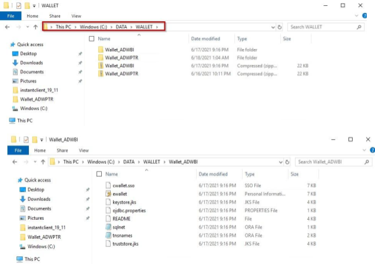

## ADB only
If you are connecting to one ADB instance, open the sqlnet.ora configuration file in the credentials directory in a text editor. You will see the following line: 

```
WALLET_LOCATION = (SOURCE = (METHOD = file) (METHOD_DATA = (DIRECTORY="?/network/admin"))) 
```
Set the DIRECTORY value to the ADB wallet directory location, such as:
```
WALLET_LOCATION = (SOURCE = (METHOD = file) (METHOD_DATA = (DIRECTORY=C:\DATA\WALLET))) 
```

If you are connecting to multiple ADBs from the same machine with a different wallet for each, add the parameter `MY_WALLET_DIRECTORY` to each connect descriptor’s specific wallet location in tnsnames.ora. For example:

```
adwptr_high = (description=(retry_count=20)(retry_delay=3)(address=(protocol=tcps)(port=1522)
(host=<host name>)) (connect_data=(service_name=<service name>))
(security=(ssl_server_cert_dn="CN=adwc.uscom-east-1.oraclecloud.com, OU=Oracle BMCS US, O=Oracle Corporation, L=Redwood City, ST=California, C=US")(MY_WALLET_DIRECTORY=C:\DATA\WALLET\ADWPTR))) 

adwbi_high = (description=(retry_count=20)(retry_delay=3)(address=(protocol=tcps)(port=1522)
(host=<host name>))(connect_data=(service_name=<service name>))
(security=(ssl_server_cert_dn="CN=adwc.uscom-east-1.oraclecloud.com, OU=Oracle BMCS US, O=Oracle Corporation,L=Redwood City, ST=California, C=US")(MY_WALLET_DIRECTORY=C:\DATA\WALLET\ADWBI))) 
```
After making your changes, save the file. 

## Managed ODP. NET Download
Navigate to the [Oracle Client for Microsoft Tools page](https://www.oracle.com/database/technologies/appdev/ocmt.html)


Click on the download link, "64-bit Oracle Client for Microsoft Tools"

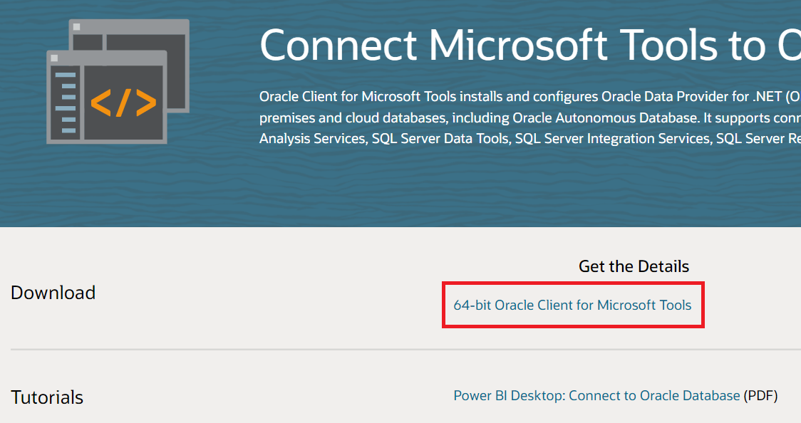.

## Log on to the Oracle Website
Select 64-bit Windows from the "Platforms" drop down
Download the Oracle Client for Microsoft Tools
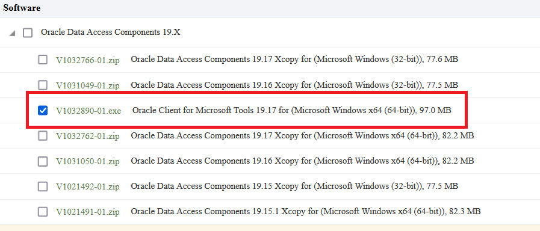

## Download the EXE
Look for `Oracle Client for Microsoft Tools.exe`
Click the EXE link and choose the local directory for the download
Click "Save" and wait for the download to complete


## Install the Oracle Client
Double click the `Oracle Client for Microsoft Tools.exe` icon
Click "Yes" in the User Account Control screen
Click "Next" on the introductory install screen

Choose the "Default" Oracle Client setup type and click "Next"
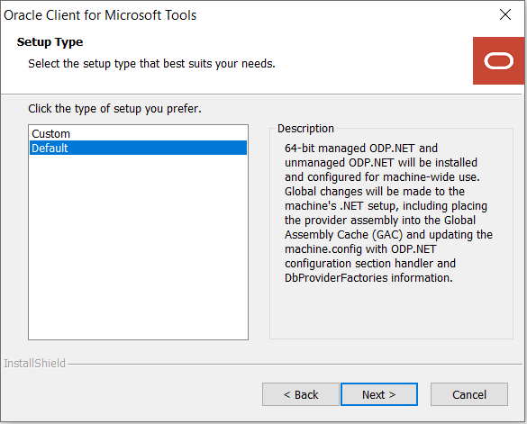
Enter the "Destination Location" for the Oracle Client installation

Enter the directory for the ODP. NET configuration files (`sqlnet.ora` and `tnsnames.ora`)
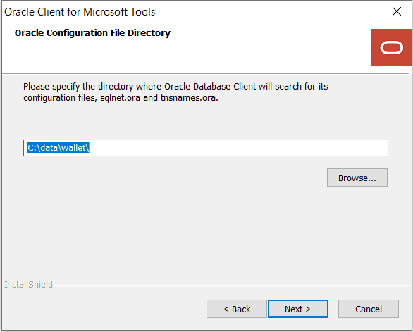

The Oracle Client for Microsoft Tools is now ready to install. Click the "Install" button to proceed.


The ODP. NET install is now complete and configured for use on this machine. On the "Wizard Complete" screen, you may review the client README. Click the "Finish" button to proceed.


If you are using tnsnames.ora file with your Oracle database, open the tnsnames.ora file to see which ADB or database net service names you can connect to. Below you see three different ones: `"adwptr_high", "adwptr_low", and "adwptr_medium"`. You will use one of these values for the SSDT and SSIS "Server name" when configuring your Oracle connection.


## Open Visual Studio
Open Visual Studio (VS). This tutorial uses VS 2022 screen shots, but the usage experience is similar in earlier VS versions. 

Create a new "Integration Services Project". Supply a name for the project. 

In Solution Explorer, right-click "Connection Manager" and select "New Connection Manager".
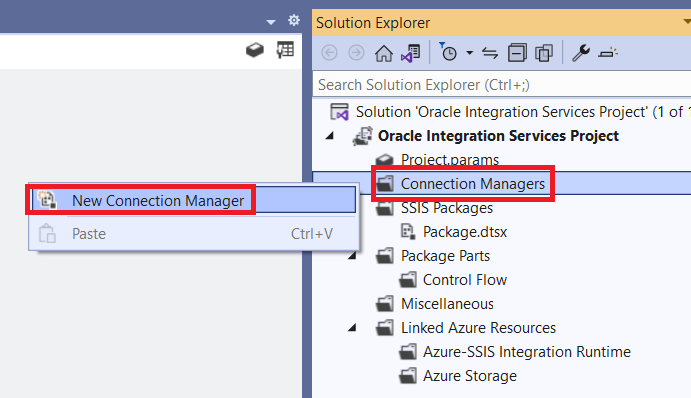

In the Add SSIS Connection Manager window, select "ADO. NET" connection manager type. Click "Add".
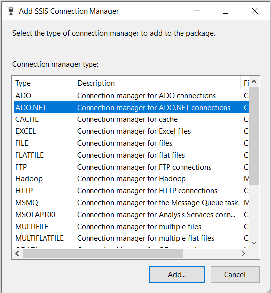

In the Configure ADO. NET Connection Manager window, click the "New.." button to start creating a new connection manager to Oracle database.
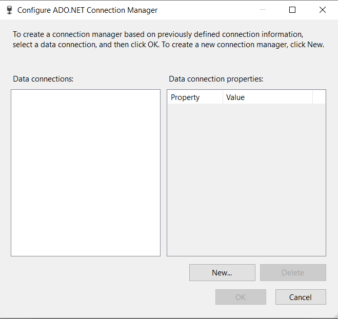

On the Connection Manager window, click the Provider drop down menu at the top. Select "ODP. NET, Managed Driver" under the .NET Providers category. Click "Ok". 
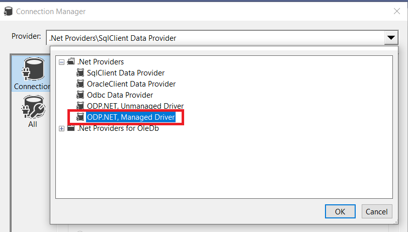


The managed ODP. NET provider connection string parameters now appear. Scroll down. Enter the Password, User Id (e.g., ADMIN), and Data Source (e.g., adwptr_high).

**Make sure** to use the user name's correct capitalization. Typically, Oracle user names are all uppercase letters (e.g., "ADMIN" instead of "admin"). If you use do not match the capitalization exactly, you will see the error `"ORA-01017: invalid username/password; logon denied".`
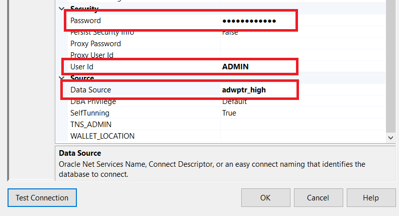


## Test Connection
Click "Test Connection" to validate a working database connection. Click "Ok".
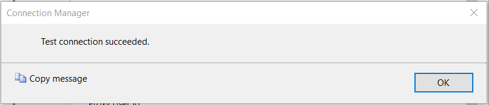

Click "Ok" on the Connection Manager window. You should now see the connection available in the Configure ADO. NET Connection Manager window. Click "Ok".
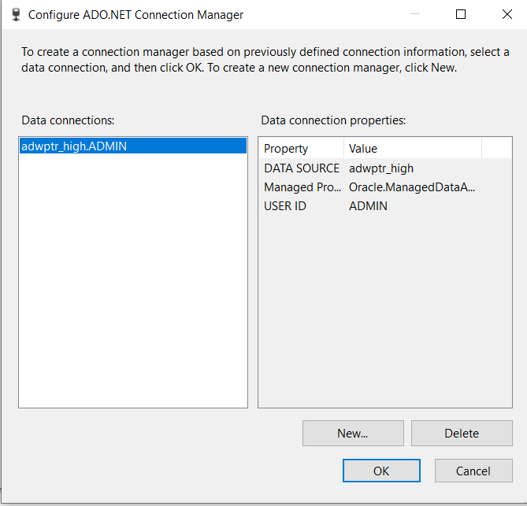

Congratulations! You have successfully connected SSDT and SSIS with Oracle database. You can now see your Oracle connection in the Solution Explorer window.
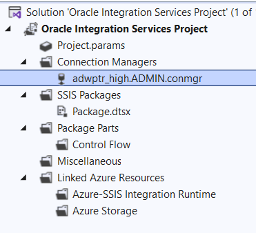

## Performance Tuning for Large Data Retrievals
Performance Tuning for Large Data Retrievals. Typically, BI applications retrieve large data amounts from a source database for further processing. To speed up Oracle data retrieval via SSDT and SSIS, the ODP. NET FetchSize can be increased from its default 128K value (131,072 bytes) to as large as int.MaxValue. The FetchSize determines the amount of data ODP.NET fetches into its internal cache upon each database round trip. It's possible to improve performance by an order of magnitude by significantly increasing FetchSize when retrieving large result sets.


## Managed ODP. NET Instructions 
To increase the FetchSize, modify the .NET machine.config file. Modifying the machine.config requires Windows Administrator privileges. This file is generally located in one of two directories. Which one to modify depends on whether your running SSDT/SSIS process is 32-bit or 64-bit: 
For 32-bit - C:\Windows\Microsoft.NET\Framework\v4.0.30319\Config
For 64-bit - C:\Windows\Microsoft.NET\Framework64\v4.0.30319\Config

Add an <oracle.manageddataaccess.client> section in the machine.config file for managed ODP. NET. This section should be placed within the `<configuration>` section and after the `<configSections> </configSections>`. Here’s an example setting the FetchSize to 4 MB with new configuration additions highlighted in green and existing configuration sections highlighted in red:

```
<configuration>
    <configSections>
    …
    </configSections>
    <oracle.manageddataaccess.client>
        <version number="4.122.19.1">
            <settings>
                <setting name="FetchSize" value="4194304" />
            </settings>
        </version>
    </oracle.manageddataaccess.client>
</configuration>
```

Restart SSDT/SSIS to run your queries with the new setting.

## **Acknowledgements**

- **Author(s)** - Pedro Torres, Alex Keh, Database Product Management
- **Contributor(s)** - Blake Hendricks Database Product Management
- **Last Updated By/Date** - Blake Hendricks, February 2023