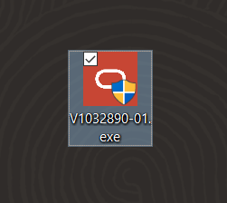
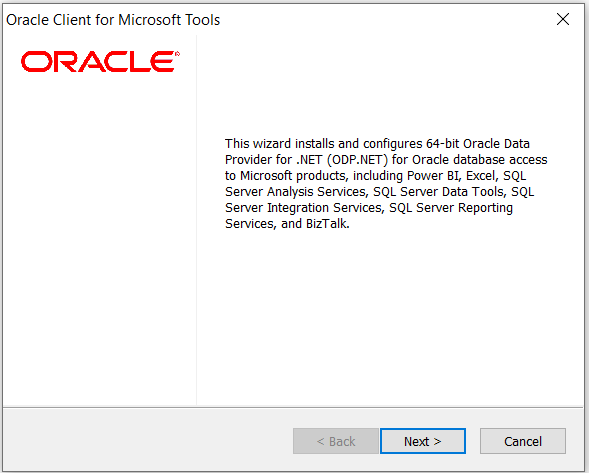
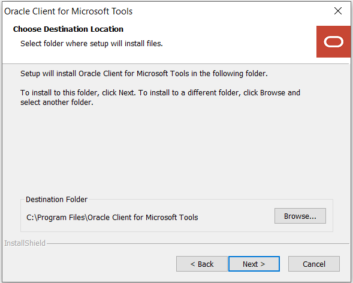
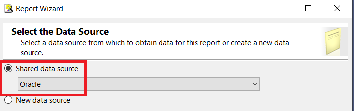
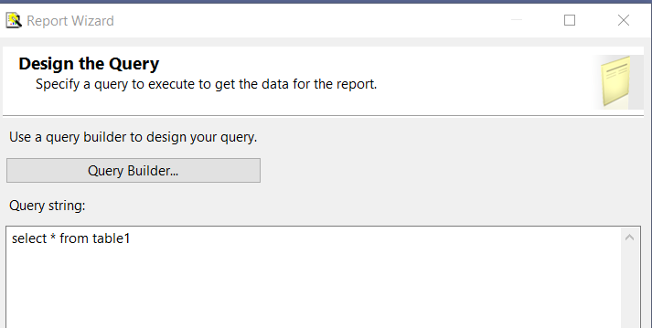

# Connecting Microsoft SQL Server Reporting Services to Oracle Autonomous Databases and On-premises Databases


This step-by-step tutorial guides how to configure Microsoft SQL Server Reporting Services (SSRS) connectivity to Oracle Autonomous Database (ADB) and on-premises databases. These instructions use managed Oracle Data Provider for .NET (ODP.NET) for data access as required by SSRS. They work for on-premises database and both dedicated and shared infrastructure ADB. The instructions for on-premises databases setup also apply to Oracle Database Cloud Services and Oracle Exadata Cloud Service.

## Overview
These are the general steps to setup Oracle database connectivity with SSRS:
1. Provision Oracle database or ADB
2. Download database credentials to Windows client
3. Install Visual Studio and Microsoft Reporting Services extension on Windows client
4. Install and configure ODP.NET on Windows client
5. Validate SSRS connects to Oracle database or ADB

## Prerequisites 
This document assumes that an on-premises Oracle database or ADB, such as Autonomous Data Warehouse (ADW) or Autonomous Transaction Processing (ATP), or Autonomous JSON Database (AJD) has been provisioned and Visual Studio with an SSRS extension is installed on a Windows client. The Windows machine can be on-premises or in the cloud, such as Oracle Cloud Infrastructure or Azure.

Connecting to Oracle databases on-premises and ADB are similar. This tutorial will note the differences between them when setting up connectivity.

If using ADB, you will need access to the Oracle Cloud Console that has access to your ADB instance. Below is a screenshot from the cloud console to a database named ADWPTR.


SSRS uses managed ODP.NET (Oracle.ManagedDataAccess.Client) for Oracle database connectivity. This tutorial uses Visual Studio 2022 to create a report server project.

## Oracle Client Installation and Setup Steps

### For ADB
1. Go to the cloud console screen for the ADB instance you will connect to. 
2. Start your ADB instance. 
3. Click on the “DB Connection” button. 
4. Download the corresponding ADB credentials zip file to the system that has Visual Studio/SSRS installed. 
   These credential files (cwallet.sso, tnsnames.ora, and sqlnet.ora) will be used to connect SSRS to ADB.
   

### For on-premises databases
1. The credential files required will depend on your database server setup. 
2. Typically, ODP.NET requires tnsnames.ora and sqlnet.ora to be accessible to connect to the database server. 
   These files can be copied from another Oracle database client that connects to the target database server.
3. Alternatively, an Easy Connect or Easy Connect Plus string can be used in lieu of credential files for on-premises databases. 
4. For example, the SSRS “Server” configuration setting can accept an Easy Connect string with the following format: 
   “<DB hostname>:<Port>/<Service Name>”. If you use Easy Connect (Plus), you can skip the credential file downloading and setup steps in this tutorial.

Place the Oracle database credentials on your Windows machine into a directory (e.g., C:\data\wallet). 
This machine is where SSRS is or will be installed on. 
For ADB, the credentials have been downloaded into a zip file that you will unzip into this directory. 
Note the directory location for use in upcoming steps.


### ADB only
If you are connecting to one ADB instance, open the sqlnet.ora configuration file in the credentials directory in a text editor. You will see the following line: 
WALLET_LOCATION = (SOURCE = (METHOD = file) (METHOD_DATA = (DIRECTORY="?/network/admin"))) 
 
1. Set the DIRECTORY value to the ADB wallet directory location, such as: 

    `WALLET_LOCATION = (SOURCE = (METHOD = file) (METHOD_DATA = (DIRECTORY=C:\DATA\WALLET)))`
 
2. If you are connecting to multiple ADBs from the same machine with a different wallet for each, add the parameter MY_WALLET_DIRECTORY to each connect descriptor’s specific wallet location in tnsnames.ora. For example: 

    ```
    adwptr_high = (description=(retry_count=20)(retry_delay=3)(address=(protocol=tcps)(port=1522)
    (host=<host name>)) (connect_data=(service_name=<service name>))
    (security=(ssl_server_cert_dn="CN=adwc.uscom-east-1.oraclecloud.com, OU=Oracle BMCS US, O=Oracle Corporation, L=Redwood City, ST=California, C=US")(MY_WALLET_DIRECTORY=C:\DATA\WALLET\ADWPTR))) 

    adwbi_high = (description=(retry_count=20)(retry_delay=3)(address=(protocol=tcps)(port=1522)
    (host=<host name>))(connect_data=(service_name=<service name>))
    (security=(ssl_server_cert_dn="CN=adwc.uscom-east-1.oraclecloud.com, OU=Oracle BMCS US, O=Oracle Corporation,L=Redwood City, ST=California, C=US")(MY_WALLET_DIRECTORY=C:\DATA\WALLET\ADWBI))) 
    ```
    After making your changes, save the file. 

3. Managed ODP.NET can be downloaded for free. From the [Oracle Client for Microsoft Tools](https://www.oracle.com/database/technologies/appdev/ocmt.html) page, click on the download link, “64-bit Oracle Client for Microsoft Tools”.


Log on to the Oracle website. In the “Platforms” drop down, select 64-bit Windows.

4. Download Oracle Client for Microsoft Tools.


Look for Oracle Client for Microsoft Tools.exe. Click the EXE link on the left side to begin the download process. Choose the local directory to download the executable to and click “Save”. You should now see the download locally.




Double click the icon to begin the install process. Next, click the “Yes” button in the User Account Control screen. You should now see the introductory install screen. Click the “Next” button.



Choose the “Default” Oracle Client setup type and click the “Next” button.


Enter the “Destination Location” where the Oracle Client will be installed on your machine. Use the “Browse” button to specify the directory location. Click “Next” when completed.



Enter the directory where ODP.NET can find its Oracle Client configuration files, sqlnet.ora and tnsnames.ora, such as C:\data\wallet. Click “Next” when complete.


The Oracle Client for Microsoft Tools is now ready to install. Click the “Install” button to proceed.


The ODP.NET install is now complete and configured for use on this machine. On the “Wizard Complete” screen, you may review the client README. Click the “Finish” button to proceed.


If you are using tnsnames.ora file with your Oracle database, open the tnsnames.ora file to see which ADB or database net service names you can connect to. Below you see three different ones: “adwptr_high”, “adwptr_low”, and “adwptr_medium”. You will use one of these values for the SSRS “Server name” when configuring your Oracle connection.


6. Open Visual Studio (VS). This tutorial uses VS 2022 screen shots, but the usage experience will be similar for earlier VS versions. 

Create a new “Report Server Project”. Supply a name for the project. 

In Solution Explorer, right-click “Shared Data Sources” and select “Add New Data Source”.


In the Shared Data Source Properties window, enter a name for the data source, choose the “Oracle Database” as the type in the drop-down menu, and click the “Build” button to start entering the connection information.


On the Connection Properties window, verify the Data Source is “Oracle Database (ODP.NET)”. Enter the Server Name (e.g., adwptr_high). Enter the database user name (e.g., ADMIN) and password. 


Click “Test Connection” to validate a working database connection. 


Click “Ok” to go back to the Connection Properties window. Click “Ok” on this window as well to return to the Shared Data Source Properties window. Click “Ok”


7. In Solution Explorer, you should now see the Oracle connection (e.g., Oracle.rds) under the Shared Data Sources item. Let’s now retrieve the Oracle database schema objects we need to use for our SSRS project. 

Right click the Reports folder. Select “Add New Report”.


In the Report Wizard, select the data source (e.g., Oracle) you just created. Click “Next”.
`


Enter the query to execute against the Oracle database. Click “Next”.



Select the report type, tabular or matrix. Click “Next”. Then, design how to group the table data. Click “Finish”. Supply a name for the report (e.g., Oracle Report). Click “Finish”.

8. Congratulations! You have successfully imported Oracle database schema objects into your SSRS project.


## Performance Tuning for Large Data Retrievals 

Typically, BI applications retrieve large data amounts from a source database for further processing. To speed up Oracle data retrieval via SSRS, the ODP.NET FetchSize can be increased from its default 128K value (131,072 bytes) to as large as int.MaxValue. The FetchSize determines the amount of data ODP.NET fetches into its internal cache upon each database round trip. It’s possible to improve performance by an order of magnitude by significantly increasing FetchSize when retrieving large result sets. 

## Managed ODP.NET Instructions 

To increase the FetchSize, modify the .NET machine.config file. Modifying the machine.config requires Windows Administrator privileges. This file is generally located in one of two directories. Which one to modify depends on whether your running Visual Studio or SSRS process is 32-bit or 64-bit: 
For 32-bit - `C:\Windows\Microsoft.NET\Framework\v4.0.30319\Config`
For 64-bit - `C:\Windows\Microsoft.NET\Framework64\v4.0.30319\Config`

Add an `<oracle.manageddataaccess.client>` section in the machine.config file for managed ODP.NET. This section should be placed within the `<configuration>` section and after the `<configSections>`
`</configSections>`. Here’s an example setting the FetchSize to 4 MB with new configuration additions highlighted in green and existing configuration sections highlighted in red:

```
xml
<configuration>
    <configSections>
    …
    </configSections>
    <oracle.manageddataaccess.client>
        <version number="4.122.19.1">
            <settings>
                <setting name="FetchSize" value="4194304" />
            </settings>
        </version>
    </oracle.manageddataaccess.client>
</configuration>
```

Restart Visual Studio or SSRS to run your queries with the new setting.


## **Acknowledgements**

* **Contributor(s)** - Blake Hendricks
* **Last Updated By/Date** - Blake Hendricks, Database Product Management, February 2023