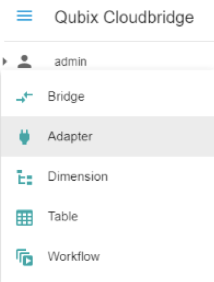

# **Creating a connection from Qubix Cloudbridge to Oracle Autonomous Data Warehouse (ADW)**

### Author: Edward Ramsden

This guide shows you how to configure Qubix connectivity to Oracle Autonomous Database (ADB). It describes how to connect Oracle Autonomous Database using the wallet or mTLS.  If you want to connect without the wallet click [here](https://oracle-samples.github.io/adb-connectors/common/tls-no-wallet/workshops/freetier/).

### Step 1: Provision ADWC and Download Connection File

1. Provision Autonomous Data Warehouse Cloud (ADWC) and download the [Wallet](../common/wallet/wallet.md). For the Oracle documentation to provision ADWC click [here](http://www.oracle.com/webfolder/technetwork/tutorials/obe/cloud/adwc/OBE_Provisioning_Autonomous_Data_Warehouse_Cloud_bak/provisioning_autonomous_data_warehouse_cloud_v2.html). Also check [Downloading Client Credentials (Wallets).](https://docs.oracle.com/en/cloud/paas/autonomous-data-warehouse-cloud/user/connect-download-wallet.html#GUID-B06202D2-0597-41AA-9481-3B174F75D4B1)
2. Email the credentials.zip file to Qubix Managed Services (support@qubix.co.uk). Managed Services will deploy the file on your managed Cloudbridge server and configure the Oracle Client to connect to ADWC.

### Step 2: Configuring Cloudbridge to connect with ADWC

- From the Cloudbridge main menu, click the “Create New” button and choose “Adapter”

  from the popup menu.

- Complete the following fields on the Adapter page
  - Choose a name for this adapter
  - Choose the default level of access that Cloudbridge users will have to this adapter
    - No Access – users will not be able to use the connection to ADWC
    - Read – users will be able to use but not modify this connection to ADWC 
    - Write - users will be able to use and modify this connection to ADWC
  - Choose “Oracle database” as the Adapter Type
  - Choose “Connect from Cloud Server” as the Local or Cloud option
  - For Server, enter the name given to you ADWC connection credentials with “_high” at the end, for example “myserver_high”
  - For Port enter 0
  - For User,enter the name of the schema in yourADWC database to which you wish to connect
  - For Password, enter the password for the user
  - For Database, enter a space (“ “)
- Click “Submit”

### Step 3: Configuring Cloudbridge to connect a table in ADWC

- From the Cloudbridge main menu, click the “Create New” button and choose “Table” from the popup menu.
- Complete the following fields on the Table page
  - Choose “Link to local database (physical table)” for Local or Cloud
  - Select the name of the Adapter that you created in Step 2
  - Enter the name of a table that you wish to view or edit
  - Click “Get Columns”. The columns of your table will appear on the screen
  - For “Table Alias” choose a descriptive name for the table. This will appear in the Cloudbridge menu
  - Choose the default level of access that Cloudbridge users will have to this table
    - No Access – users will not be able to see this table 
    - Read – users will be able to view but not edit this table
    - Write - users will have fill access to the table
  - Choose the editing actions that users can perform on the table if they have Write access
  - Choose whether full version history of all edits to the table will be enabled o 
  - Click the Submit button. The ADWC table will be added to the main menu