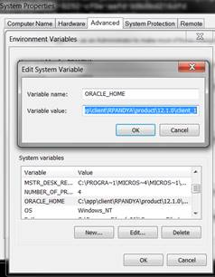
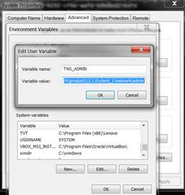
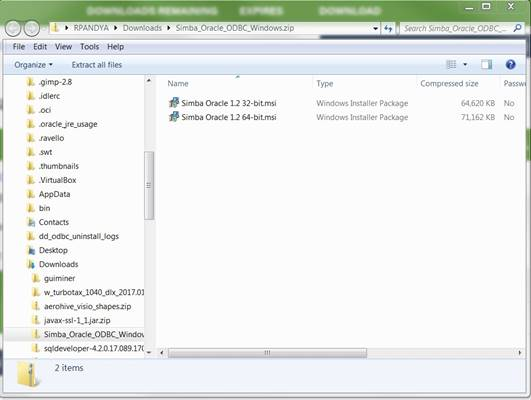
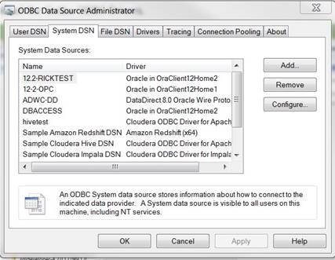
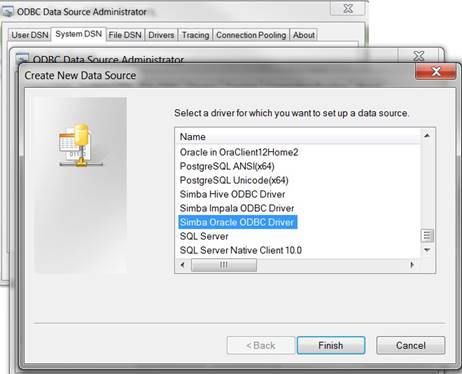
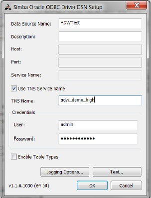
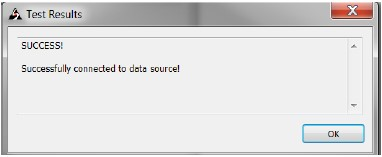
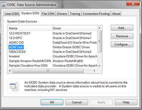

**Introduction**

ADWC supports connections from standard drivers including JDBC, ODBC, and ADO.NET. Analytic tools may use 3rd party drivers from providers such as Simba. In order to work with ADW, the driver must support Oracle Wallets and SSL encryption. Not all analytic tools package the latest driver versions, so you may be required to update the driver to connect successfully. This document describes how to generally setup and configure Simba drivers, for tool vendors using this provider. Please check the analytic tool documentation in case they have specific connectivity interfaces.

| Validation Matrix  | Version  |
| ------------- | ------------- |
| Simba  | ODBC 1.1.6 driver and higher  |
| Oracle Client  | 12.1.0.2 or higher |


## **Creating a connection using Simba ODBC Drivers to Oracle Autonomous Data Warehouse**


1. This document assumes that the Autonomous Data Warehouse has been provisioned and the corresponding credentials.zip file has been downloaded to the system that has the Simba ODBC Driver installed. For the Oracle documentation to provision ADWC please check here. Also check Downloading Client Credentials (Wallets).

2. Download and install the latest version of Oracle Client or the Instant client from here.

3. Unzip the downloaded file and follow the instructions to install an Oracle Instant Client or an Oracle Client. Complete installation guidelines can be found here.

4. Steps 4,5 and 6 configure and test the Oracle Database Client. Edit the sqlnet.ora file, replacing “?/network/admin” with the name of the folder containing the client credentials.
  For example:
  ```
  WALLET_LOCATION = (SOURCE = (METHOD = file) (METHOD_DATA = (DIRECTORY="D:\home\adwc_credentials")))
  SSL_SERVER_DN_MATCH=yes
  ```
5. Setthe ORACLE\_HOME and TNS\_ADMIN environment variable and set it to the location of the secure folder containing the credentials file you saved in Step 3. These can optionally be user environment variables as well if it is not a multi user environment.

    

    

6. The `tnsnames.ora` file provided with the credentials zip file contains three database service names identifiable as high, medium and low. The predefined service names provide different levels of performance and concurrency for Autonomous Data Warehouse.

7. Test the Oracle Client with Oracle SQL*Plus

  ```
  sqlplus password/\"Password\"@ConnectString
  or
  sqlplus /nologsql> set define offsql> connect username/password@connectString
  ```

8. The Simba driver relies on the ORACLE\_HOME and TNS\_ADMIN environment variables to implicitly access the tnsnames.ora and sqlnet.ora attributes.
9. Download the Simba Driver

    

10. Please refer to the [Simba documentation here](https://documentation.insightsoftware.com/oracle-odbc/content/oracle_odbc.htm) to install and configure the Simba ODBC driver based on your OS.  
11. This document describes how to install and configure the driver on Windows 64 bit OS. Invoke the 64-bit Microsoft ODBC Administrator to create a DSN (system or file) using tnsnames entry. More information about configuring the Simba ODBC driver can be found [here](https://insightsoftware.com/drivers/oracle-odbc-jdbc/)
12. Here are some pictorial examples for your reference. MSFT 64 bit Windows OS has been used for the example below.

    

    Once unzipped and installed, open the 64 bit ODBC Administrator on Windows to configure system DSN that uses the Simba driver. Click on Add to configure a new system DSN under the System DSN tab. Locate the Simba ODBC Driver from the list of drivers presented to you and press finish.

    


    You will be presented with a form for the DSN attributes. Fill in the DSN name, your TNS name (this can be found in the tnsnames.ora file in TNS\_ADMIN location) and optionally the username and the password.


    

    You can also test the connection here before saving it.

    

    You are now ready to use this system DSN for your application!

    


Note: These instructions are for reference purposes only. As versions of this driver changes, there may be different configuration methods. Please refer to the vendor website for latest details. Please refer to the vendor documentation on all the configuration options that are available for you to set.


## **Acknowledgements**
* **Author(s)** - Rick Pandya, Aalok Muley
* **Contributor(s)** -
* **Last Updated By/Date** -  
