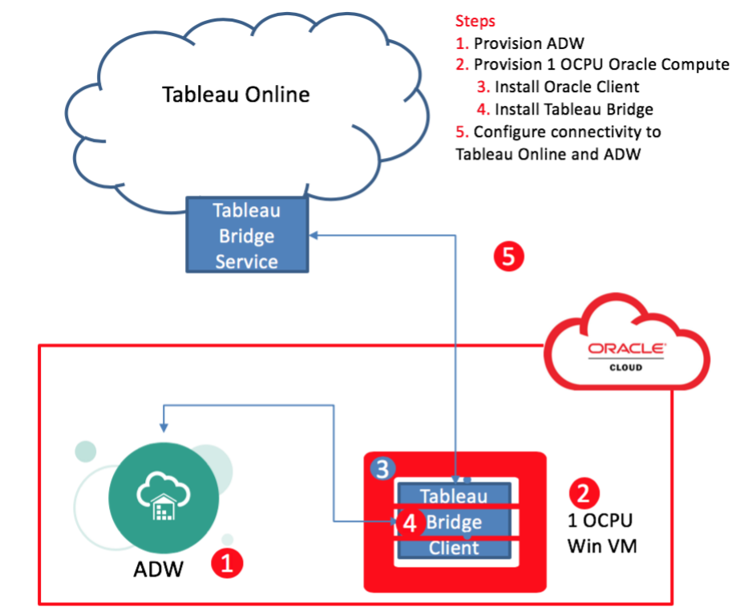
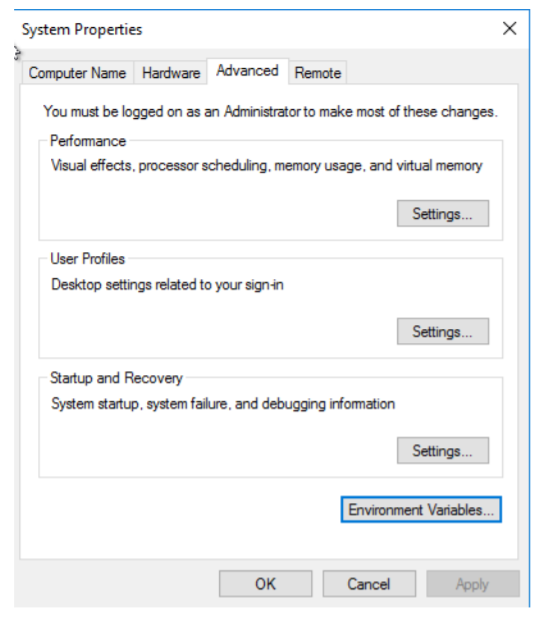
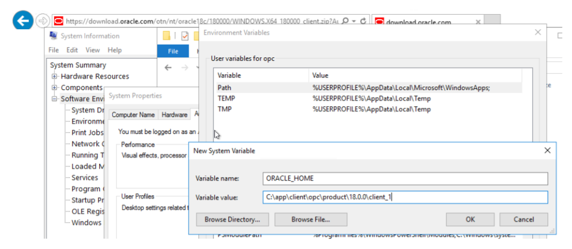
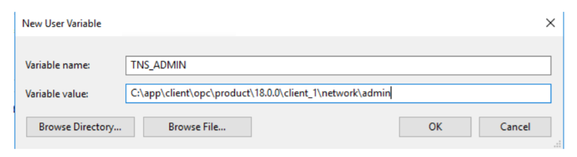
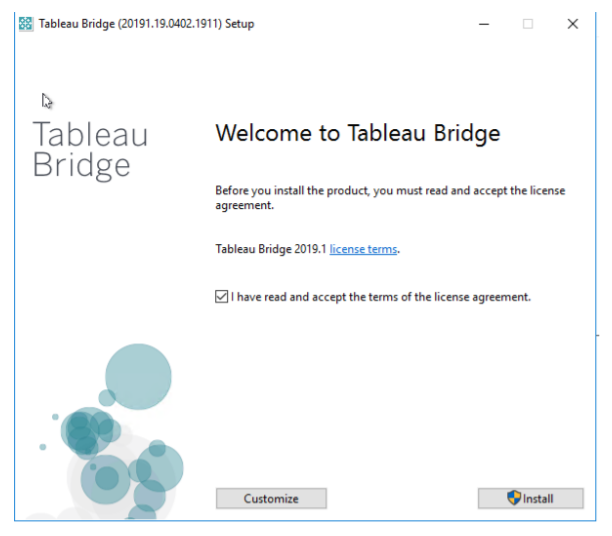
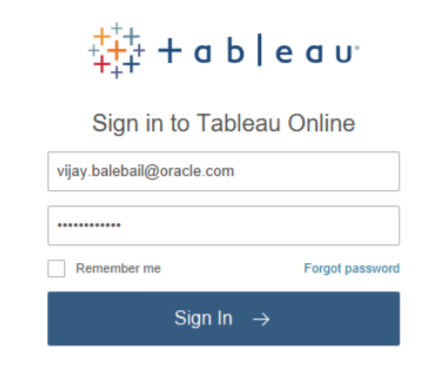
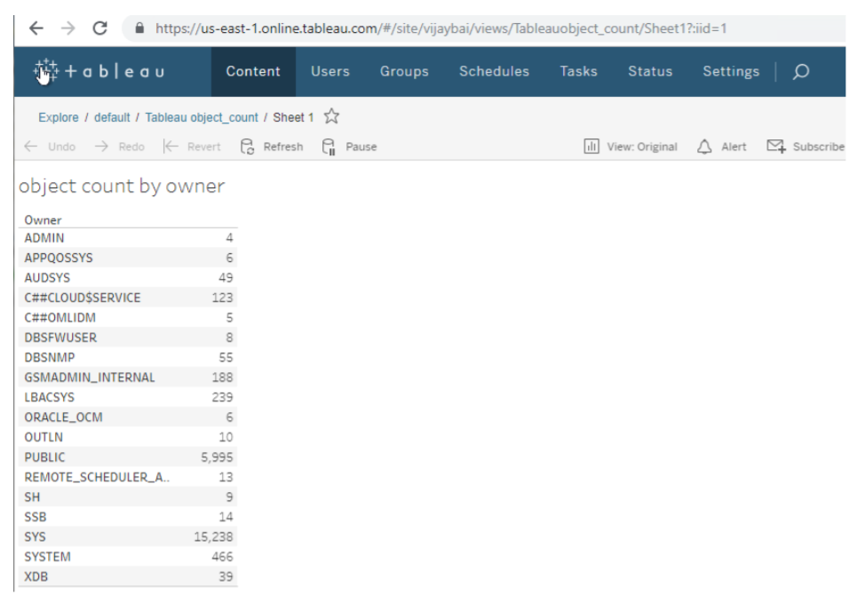
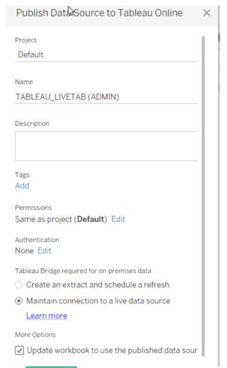

## **Connecting Tableau Online to Oracle Autonomous Database**

This document describes how to setup connectivity between Tableau Online and the Oracle Autonomous Database (ADB). The Tableau Online architecture uses a Tableau Bridge Service and a corresponding Tableau Bridge Client software to connect to ADB.

## **Configuring Tableau Online**

The figure below shows a high level overview of what you will install and configure to connect Tableau Online to ADB.

## Pre-requisites

1. Provision Autonomous Database (ADB). ADB includes Autonomous Data Warehouse (ADW) or Autonomous Transaction Processing (ATP), or Autonomous JSON Database (AJD).  To provision ADB, see [here](https://docs.oracle.com/en/cloud/paas/autonomous-database/adbsa/autonomous-provision.html#GUID-0B230036-0A05-4CA3-AF9D-97A255AE0C08).
2. To connect Tableau Online to ADB, a Tableau bridge software needs to be installed and configured on a 1 OCPU Compute running Windows on OCI.
3. Download, install and configure the Oracle Instant Client 18c or higher on the Windows VM.  To install Oracle Instant Client see [here](https://docs.oracle.com/en/database/oracle/machine-learning/oml4r/1.5.1/oread/installing-oracle-database-instant-client.html#GUID-A0AAF57E-D74F-43F1-BD92-81D197EFE17F)

## Task 1: Set Environment Variables

1. Once you have installed the Oracle Instant Client software, set the environment variable ORACLE_HOME.

   

   

2. Next set TNS_ADMIN to directory where the wallet file is going to be unzipped. The location can be $ORACLE_HOME/network/admin.

   

3. Download the ADB wallet into the TNS_ADMIN directory using the instructions at Downloading Client Wallet Credentials [here](https://docs.oracle.com/en/cloud/paas/autonomous-data-warehouse-cloud/cswgs/autonomous-connect-download-credentials.html).

## Task 2: Download Tableau Bridge

1. Download the Tableau Bridge from the Tableau [website](https://www.tableau.com/support/releases/bridge#current) and install and configure it using the following steps:

   a) Install Tableau Bridge Client

   b) Start Tableau Bridge and log into your Tableau Online domain account

      

      

   **NOTE:** A screen will pop-up and show all the data sources that are available. These data sources are generally published from the Tableau Desktop to Tableau Online using the optional steps detailed in Step 2 below. The bridge will now download all the data source configurations. Depending on if the data source is in Live or Extract mode, the bridge will push data from ADB to Tableau Online.

      

   c)  Switch from Application mode to service mode. This way, as long as the bridge Windows server is 		up and running, the Bridge software will continue running.

      

      

2. (Optional) Develop dashboards on Tableau Desktop and Publish to Tableau Online.

   **NOTE:** This document is focused on connecting Tableau Online to ADW using the Tableau Bridge. From Tableau Desktop server, publish the Data Source and Workbooks to Tableau Online by signing in with the Domain account.

## Task 3: Publish your Workbooks and Data Source
1. Publish Workbooks

   

2. Choose a name for your Published workbook.

   

3. Click Publish.  The Workbook is now published online. You will need to publish the Data sources as well to Tableau Online so that the information can be pushed to the Bridge server.

   

4. Publish the Data Source

   

5. Choose Live Connection

   

6. Click Publish.

   In the online browser, you will see this published.

   

Congratulations! Once you have published the Data sources and workbooks to Tableau Online you will be able to see the data sources on Tableau Bridge.

## Similar Connector Documents
- [Connect Tableau Desktop to ADB](https://oracle-samples.github.io/adb-connectors/tableau-online/workshops/freetier/#SimilarConnectorDocuments)

## **Acknowledgements**

* **Author(s)** - Vijay Balebail, Database Product Management
* **Contributor(s)** - Milton Wan, Database Product Management
* **Last Updated By/Date** - Blake Hendricks, Database Product Management, July 2022
