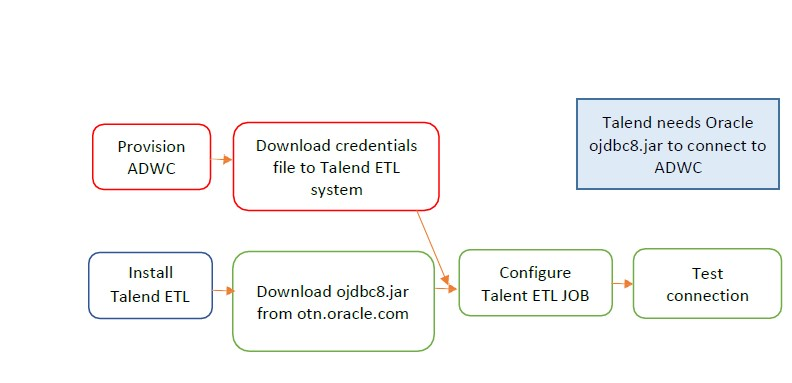
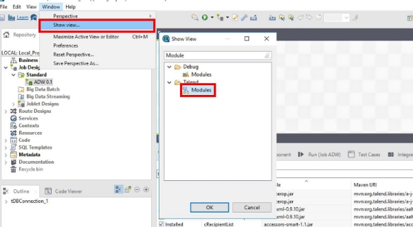
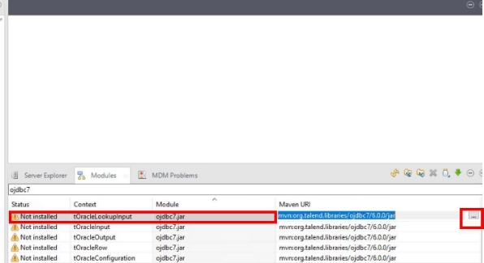
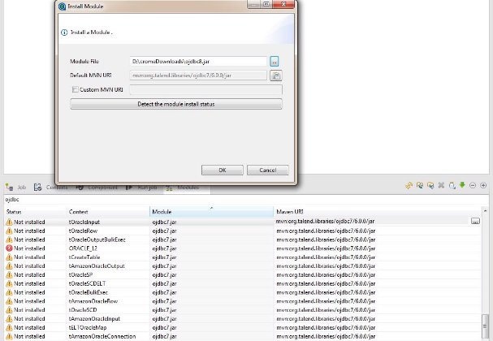
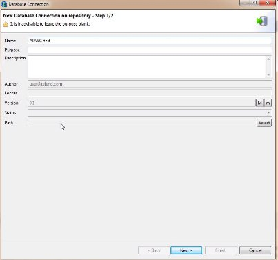
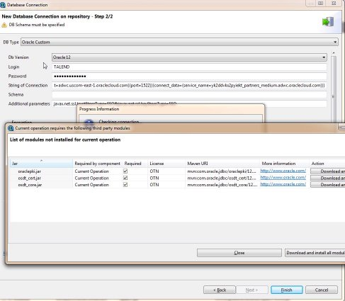

**Introduction**

Talend is an ETL tool for Data Integration. It provides software solutions for data preparation, data quality, data integration, application integration, data management and big data.  

Here is the overview of the install and configuration process to get Talend connected to ADWC.

 | Validation Matrix  | Version  |
 | --- | --- |
 | Talend ETL Tool  | 7\.x or higher  |
 | Oracle JDBC   | ojdbc8.jar or higher |

 ### **Prerequisites**

 - Required access and credits to provision ADWC instance on Oracle Cloud.
 - Download Oracle JDBC Thin driver is downloaded on the app server.
 - If ADWC is already configured you have the ADMIN user password and ADB Wallet is downloaded on app server.
 - Talend needs Oracle  Provision  Download credentials  ojdbc8.jar to connect to  ADWC  file to Talend ETL  ADWC system

 ## **Configure the Connection**

  1. This document assumes that the Autonomous Data Warehouse has been provisioned and the corresponding client credentials.zip file has been downloaded to the system that has the Talend installed. For the Oracle documentation to provision ADW please check[ here.](https://docs.oracle.com/en/cloud/paas/autonomous-database/adbsa/autonomous-provision.html#GUID-0B230036-0A05-4CA3-AF9D-97A255AE0C08) Also check[ Downloading Client Credentials (Wallets). ](https://docs.oracle.com/en/cloud/paas/autonomous-database/adbsa/connect-download-wallet.html#GUID-B06202D2-0597-41AA-9481-3B174F75D4B1)

  2. Follow the instructions from the Talend documentation to install the software on the desktop. As a prerequisite make sure that you have installed the Oracle JDK and configured for JDBC prerequisites.

  3. All connections to Autonomous Data Warehouse use certificate-based authentication and Secure Sockets Layer (SSL). Copy the client credentials file that you downloaded in step 1 to the system running the Talend ETL and uncompress it into a secure folder.

  4. Download ojdbc8.jar from the Oracle website. You need it to connect Talend 7.x to ADW. If you currently have Talend 7.x installed check to see if ojdbc7.jar has been configured. You need to replace ojdbc7.jar with ojdbc8.jar You could still create an ETL job to load ojdbc8.jar (TLibraryLoad) in your Job Design Canvas, and override the existing ojdbc7.jar configuration.

  5. The simpler solution is to go through a fresh install of Talend 7.x and configure ojdbc8.jar.Download the latest 18.3 JDBC Thin driver (ojdbc8.jar and ucp.jar) from[ Oracle Database 18c (18.3) JDBC Driver & UCP Downloads.](https://www.oracle.com/technetwork/database/application-development/jdbc/downloads/jdbc-ucp-183-5013470.html)

  6. You also need the additional jars: oraclepki.jar, osdt\_core.jar, and osdt\_cert.jar for use with Oracle wallets.  Include them in your classpath.

  7. In the Talend studio, display the Module View navigate to Window -> Show view… ->  search for “Module” -> click Module.

    

  8. Search for ojdbc7.jar and click on 

  

  9. Browse to the directory where you downloaded ojdbc8.jar in step 4 to replace ojdbc7.jar If ojdbc7.jar is already installed, you will see error that the module is already installed.

  

  10. Once the ojdbc8.jar driver is loaded, you can now create a Metadata DB connection. Click Metadata ->  Database Connection ->  Create Connection.

  

  Enter connection name and click next.

  11. Choose Oracle Custom driver, enter the login username and password. And enter the jdbc url. Here is a sample syntax/example:  **jdbc:oracle:thin:@(description=(address=(protocol=tcps)(port=1522 )(host=adwcHostName))(connect\_data=(service\_name=serviceName))(security=(my\_wallet \_directory=/your wallet/wallet-directory-path))**  

  Note- in the my\_wallet\_directory you have to use your complete wallet directory path.

  Add the following in “Additional Parameters” **javax.net.ssl.trustStoreType=SSO & javax.net.ssl.keyStoreType=SSO**

  Enable check box for “Use Encryption“ and “Need Client Authentication”. Enter the full path for the cwallet.sso file extracted from the credentials.zip in step 1 and add it to the TrustStore and KeyStore parameters. Password is not required for the cwallet.sso file. Click “Test Connection”.

  For the first time you “Test Connection” a pop-up window will appear that will ask for more jar files to be installed. Click “Download and Install All Modules Available”.

  

  12. Click “Test Connection” again.

  

  A message box will appear indicating that the connection was successful. You have now successfully validated a connection from Talend 7.x to ADW. You could use this DbConnection object in your job design canvas to connect to ADW

  13. If you want to execute job from different source, initialize the Database connection with in the ETL job as pre job to run the job successfully.
          

## **Acknowledgements**
* **Author(s)** - Vijay Balebail, Satyabrata Mishra
* **Contributor(s)** -
* **Last Updated By/Date** -  
