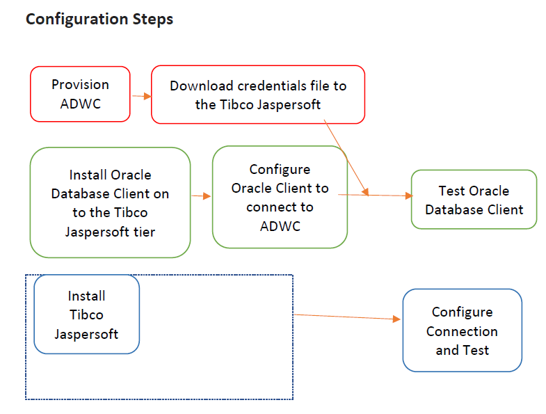
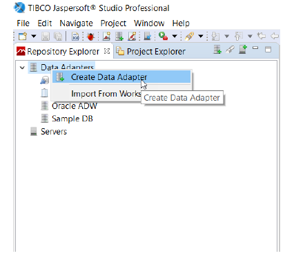
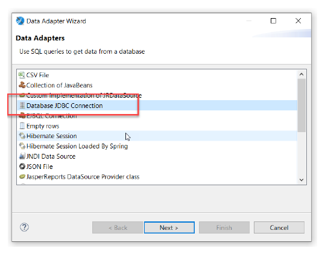
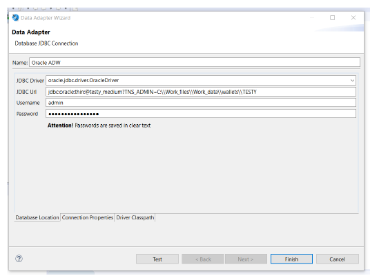
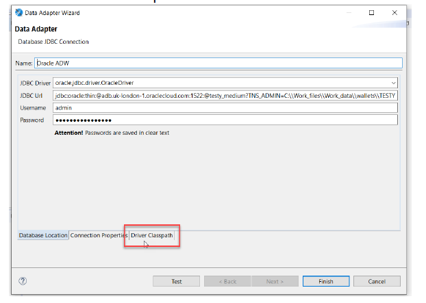
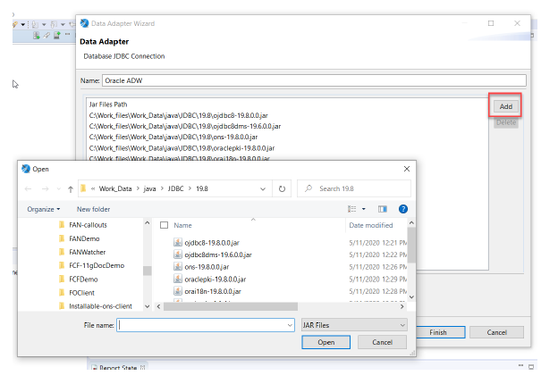
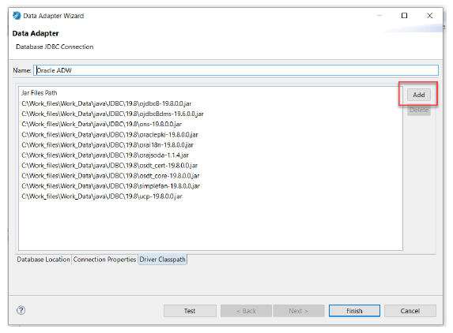
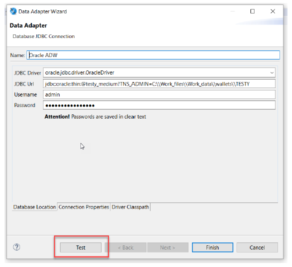
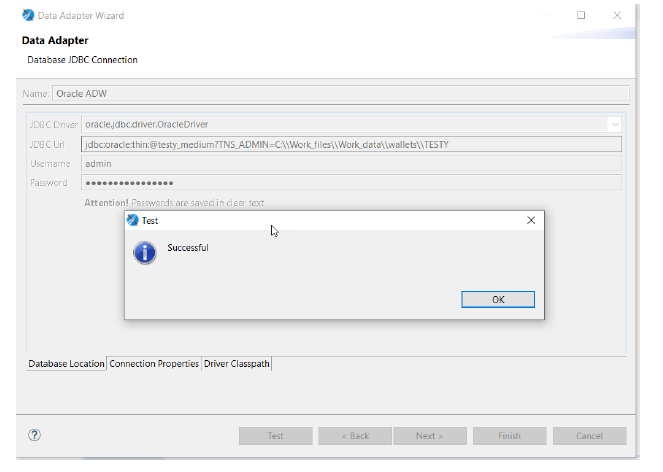

### **Introduction**

This guide shows you how to configure Tibco Jaspersoft connectivity to Oracle Autonomous Database (ADB).

These instructions were documented using Jaspersoft 7.8 and Oracle Client 19.8.

## **Prerequisites**

- Autonomous Database (ADB) is provisioned. ADB includes Autonomous Data Warehouse (ADW) or Autonomous Transaction Processing (ATP), or Autonomous JSON Database (AJD).  To provision ADB, see [here](https://docs.oracle.com/en/cloud/paas/autonomous-database/adbsa/autonomous-provision.html#GUID-0B230036-0A05-4CA3-AF9D-97A255AE0C08).
- Jaspersoft is installed on a machine (local, OCI, or other cloud).   
- If you are connecting with ADB Wallet, download it on your machine running Jaspersoft.  To download and configure the wallet see [here](https://docs.oracle.com/en/cloud/paas/autonomous-data-warehouse-cloud/cswgs/autonomous-connect-download-credentials.html#GUID-B06202D2-0597-41AA-9481-3B174F75D4B1).
- If you are not connecting with ADB Wallet, configure ADB with TLS  [here](https://blogs.oracle.com/developers/post/securely-connecting-to-autonomous-db-without-a-wallet-using-tls).
- Oracle Instant Client is downloaded and configured.  To install Oracle Instant Client see [here](https://www.oracle.com/database/technologies/instant-client.html).

## **Configuring Jaspersoft with Oracle Client**

Here is a diagram on the steps to configure Jaspersoft.



1. Provision Autonomous Database (ADB) and download the corresponding wallet zip file containing the ADB credentials to the system that will have the Tibco Jaspersoft installation.  Unzip the wallet zip file to a secure folder.

2. Download the [Oracle Instant Client](https://www.oracle.com/database/technologies/instant-client.html) and SQL*Plus package to the system where Tibco Jaspersoft is installed. Validate that the Oracle Client can communicate with ADB, and since it is installed on the same system as Tibco Jaspersoft, it ensures that Tibco Jaspersoft is also configured correctly.

3. Edit the sqlnet.ora file, replacing “?/network/admin” with the name of the folder containing the wallet client credentials.

  For example, on Linux:
    ```
    WALLET_LOCATION = (SOURCE = (METHOD = file) (METHOD_DATA = (DIRECTORY="/home/adwc_credentials")) (SSL_SERVER_DN_MATCH=yes))
    ```

  For example, on Windows:
    ```
    WALLET_LOCATION = (SOURCE = (METHOD = file) (METHOD_DATA = (DIRECTORY="C:\Work_files\Workdata\wallets")) (SSL_SERVER_DN_MATCH=yes))
    ```


4. Create the TNS_ADMIN environment variable and set it to the location of the secure folder containing the credentials file. The tnsnames.ora file provided with the credentials zip file contains three database service names identifiable as high, medium and low. The predefined service names provide different levels of performance and concurrency for Autonomous Data Warehouse Cloud. Use one of these service names in your `ConnectString`.

5. Test the Oracle Client with Oracle SQL*Plus
    ```
    sqlplus password/\"Password\"@ConnectString
    ```
   or
    ```
    sqlplus /nolog
    sql> set define off
    sql> connect username/password@connectString
    ```

   If the connection is successful you are ready to move to the next step.

## **Install JDK and JDBC**

The JDBC drivers are certified with a JDK version.  ojdbc8.jar is certified with JDK8, JDK9, JDK11, ojdbc10.jar is certified with JDK10, JDK11.

1. Install the appropriate JDBC driver.
   The Oracle 19c (19.8) JDBC client driver can be downloaded from [JDBC Driver and UCP Downloads.](https://www.oracle.com/database/technologies/appdev/jdbc-ucp-19-8-c-downloads.html)  Download either `ojdbc8-full.tar.gz` or `ojdbc10-full.jar.gz`.

## **Install Jaspersoft**

1. Install Tibco Jaspersoft.
   If there is a pre-existing Tibco Jaspersoft installed jump to the steps to configure ADB as a target.
   To install Tibco Jaspersoft software please refer to the [Install Documentation](https://www.jaspersoft.com/getting-started).

2. Configuring Tibco Jaspersoft to connect with ADB
   Tibco Jaspersoft recommends using the native Oracle Driver "Oracle Net Client". This is what's listed in the Tibco Jaspersoft manual and uses TNS based connection to connect to ADB securely using TCPS connection protocol. Since we have tested the validity of connection to ADB using SQL*Plus, we can use the same connect string to connect to ADB.
3. Force Tibco Jaspersoft to ignore the embedded (shipped) JDK and use the JDK installed above.
   Edit the file “Jaspsersoft Studio Professional.ini” and remove the line identifying the VM. This will be similar to:
   `-vm features/jre.win32.win32.x86_64.feature_1.8.0.u151/jre/bin`
4. In the repository explorer right click to `Create Data Adapter`.

    

5. Choose a Database JDBC Connection

    

6. Enter the following details in to the create pane:

    | Validation Matrix  | Version  |
    |---------|---------------|
    |Name:| Oracle ADW (choose a name)|
    |JDBC Driver:| oracle.jdbc.driver.OracleDriver|
    |JDBC URL:|jdbc.oracle.thin@:testy\_medium?TNS\_ADMIN=C:\\Work\_files\\Work\_data\wallets\TESTY|
    |Username:| admin|
    |Password:| \*\*\*\*\*\*\*\*\*\*\*\* (password for admin user)|

    The entry for the JDBC Driver is oracle.jdbc.driver.OracleDriver<br>
    Update components of the JDBC URL entry with values corresponding to your system. In the example:<br>
    testy\_medium is a TNS alias (present in your tnsnames.ora file) corresponding to DBName\_service where service is high, medium, or low.<br>
    TNS\_ADMIN is the directory into which the wallet file was expanded.<br>
    Username is admin<br>
    Password was set when you created your Autonomous Database.<br>

    

7. Select the `Driver Classpath` tab.

    

8. Add the following jar files from the directory you unzipped the JDBC client driver above.

    

    Classpath must include:
    - `ojdbc8.jar (or ojdbc10.jar)`
    - `oraclepki.jar`
    - `osdt_cert.jar`
    - `osdt_core.jar`
    and can optionally include:
    - `orai18n.jar`
    - `orajsoda.jar`
    - `ojdbc8dms.jar`
    - `ons.jar`
    - `simplefan.jar`
    - `ucp.jar`

    **Note**: that the names shown here, omit version numbers that may exist in later downloads.
    There is no harm in configuring all jars, this covers all potential needs.

    

9. `Test` the connection.

    

    A message will indicate successful connection.

    

10. Select `Finish` to save the adapter.


## **Acknowledgements**

* **Author(s)** - Troy Anthony, Database Product Management
* **Contributor(s)** - Milton Wan, Database Product Management
* **Last Updated By/Date** - Blake Hendricks, DB Product Management, July 2022
