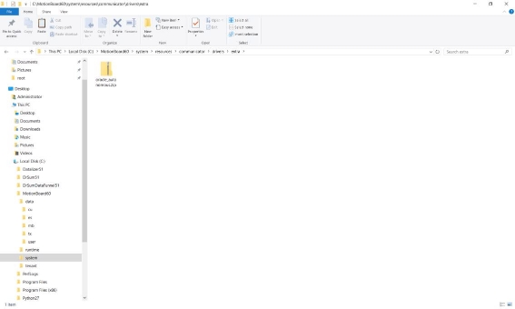
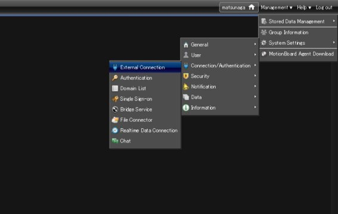
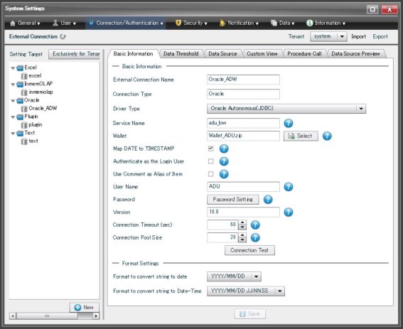
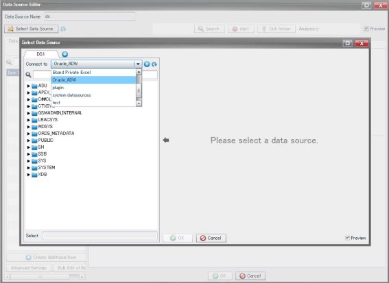
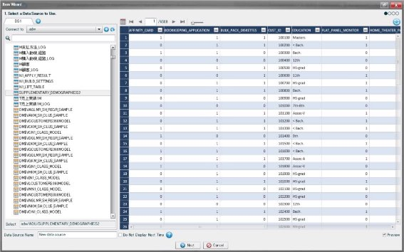
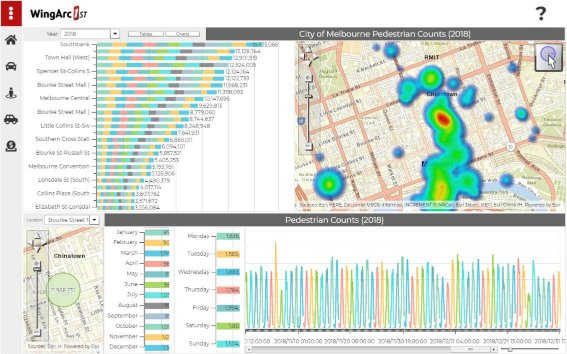

**Introduction**

|Validation Matrix |Version |
| ---- | ----- |
|MotionBoard |6\.0.00.0020 (and higher) |
|Oracle Client |Oracle JDBC 18.3 (and higher) |

### **Prerequisites**

- The  connection  destination  must  be  in  an  environment  where  it  can  communicate  with MotionBoard and runs correctly. It’s necessary that user have knowledge about network and server environment.
- This document assumes that the Autonomous Data Warehouse has been provisioned and the corresponding wallet zip file has been downloaded to the system.

## **Configure the Connection**

### Step 1: Install MotionBoard

If there is a pre-existing Motionboard installed jump to Step 3 which describes the steps to configure ADWC as a target.

To install Motionboard software please refer to the Install[ Documentation.](https://manual.wingarc-support.com/en-us/manual/mb/mb60/)

### Step 2: Install Oracle driver on MotionBoard (ONLY for “on premises” version)**

1. Open installer file and select “MotionBoard60 - extra”.
2. Copy  “oracle\_autonomous.zip”  to “[InstallDir]\system\resources\communicator\drivers\extra”.
3. Restart “Motionboard 6.0” service.
  

### Step 3: How to configure MotionBoard on a Windows environment

1. Select the type of data source to connect to
    1. Log in to MotionBoard as a user with administrator privileges.
    2. Select Management of the board menu - System Settings - Connection/Authentication - External Connection.

  

    3. Click the New button on the External Connection screen.
    4. Enter the name of the external connection settings in External Connection Name on the Create New External Connection screen.
    5. In Connection Type, select the connection destination (data source name).
    6. In Relay Service, select a connection method for connecting with the destination. If Relay Service does not appear, proceed to the next step.
    7. To connect directly to the connection destination, select Disable. Usually, you select this option.
    8. To use the Bridge Service, select Bridge Service and select the Bridge group to use for Bridge Group Name.
    9. To use the Federation Service, select Federation Service and select the Bridge group to use for Federation Name.
    10. Click the New button.
    11. Click the OK button on the message to confirm saving the settings.

2. Specify information necessary for connection with Oracle Autonomous Data Warehouse

    1. Click the Basic Information tab in the External Connection screen.
    2. Specify Driver Type. Select to connect to “Oracle Autonomous(JDBC)”.
    3. Check the settings for Relay Service and change them as necessary.
    4. In Service Name, specify the name of the Oracle Autonomous Data Warehouse Service.
    5. Click “Select” button of Wallet and select corresponding wallet zip file.
    6. In  User  Name,  specify  the  user  ID  equivalent  to  the  server  administrator  of  Oracle Autonomous Data Warehouse.
    7. Click the Password setting button of Password, and specify the password for User Name.

      

3. Confirm you can connect to the connection destination

    1. Click the Connection Test button.
    2. If a message indicating connection succeeded is displayed, proceed to the next step.
    3. If a message indicating connection failed is displayed, return to the previous step and review the setting.
    4. Click the Save button.
    5. Click the OK button on the message to confirm saving the settings.

### Step 4: Check connectivity between MotionBoard and Oracle

1. Create New dashboard to check the connectivity.
    1. Click the New and create new dashboard.
    2. Create new data source of charts or spreadsheet.
    3. Select the data source type you made in Step 2(for example “Oracle\_ADW”) from connect type.

      

    4. Choose table or view in table and view list.

      

    5. Drag and drop items from Item List to column, row and summary item field in Data Source Editor.
    6. Click OK and save data source definition.

2. When a chart or spreadsheet is deployed and show its data from Oracle, then you’re now ready to  read  data  from  Oracle  Autonomous  Data  Warehouse.  And  analyze,  visualize  the  with MotionBoard.

    

## **Acknowledgements**
* **Author(s)** - Milton Wan
* **Contributor(s)** -
* **Last Updated By/Date** -  23/Jul/2019
